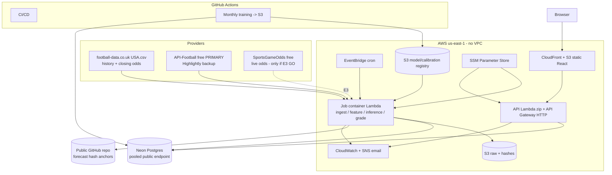
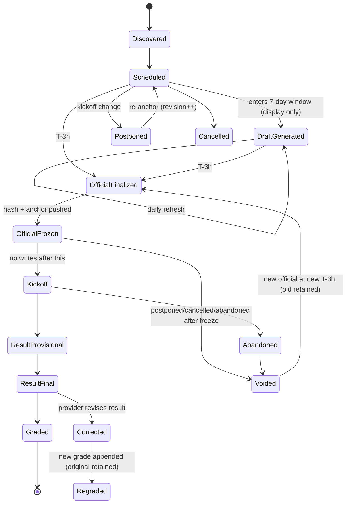
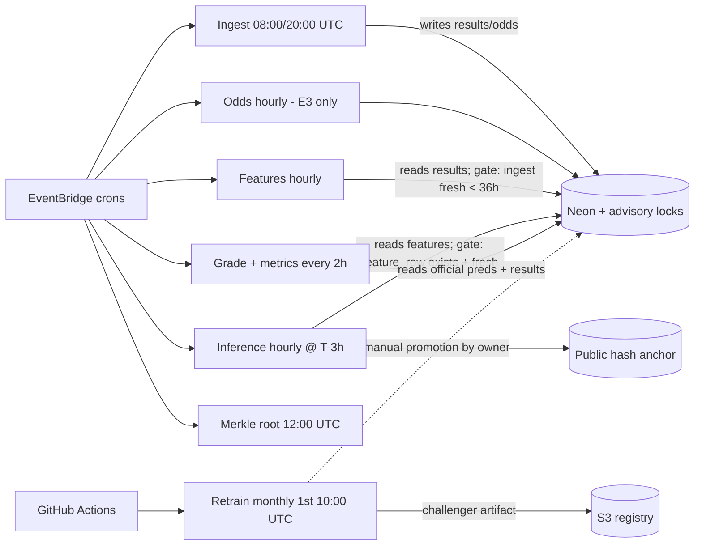

# KickLens — Build Contract Version 2.1

**Purpose:** a decision-complete implementation contract handed to a team that may not guess. Supersedes V2.0 for implementation. Every ambiguity in V2.0 is resolved to a single frozen choice; the **only** unresolved items are the three blocking pre-build experiments (E1–E3) explicitly isolated in §2. In-build empirical choices (E4–E6) have **safe defaults** so they never block the start.
**Principle applied:** no scope increase; simplest defensible choice; one implementation per decision, plus at most one named emergency fallback.
**Date:** June 14, 2026 · **Build window:** ~45–60 h over 3–4 weeks · **Launch target:** MLS resumption (~July 16, 2026).
**Document note:** this document *is* output 13 (the Build Contract); outputs 1–12 are its sections.

---

## 1. Ambiguity register

| # | V2 location | Ambiguous text / gap | Class | Resolution (this contract) |
|---|---|---|---|---|
| A1 | §4 | cutoff offset "finalized in the spike" | Decide now | **Cutoff = kickoff − 3h (T-3h)**, frozen |
| A2 | §8,§18 | "GBT only if it clears a gate" / "choose empirically" | Experiment (E4) | Primary = logistic; LightGBM is challenger experiment with a default of *not shipping* |
| A3 | §18 | "if needed temperature/Dirichlet; isotonic only if sample supports" | Decide now | **Temperature scaling only**; isotonic + Dirichlet removed from MVP |
| A4 | §18 | "first check whether logistic is already calibrated" (branch) | Decide now | **Always fit temperature scaling**; the learned T is a reported diagnostic (T≈1 ⇒ was already calibrated). No branch |
| A5 | §14,§16 | rolling windows "5 and 10" | Configurable | Both 5 and 10 included in **fs-v1** (fixed) |
| A6 | §10 | live results "API-Football and/or Highlightly" | Decide now | **Primary = API-Football; backup = Highlightly** |
| A7 | §8,§24 | market "optional… may be dropped"; live same-cutoff "conditional" | Experiment (E3) | **Historical closing-odds comparison = MVP**; live same-cutoff = conditional on E3 |
| A8 | §30 | retrain "monthly or after ≥N matches" | Decide now | **Monthly, 1st of month, in-season**; "≥N" removed |
| A9 | §14 | "opponent-adjusted form preferred where feasible; else raw" | Decide now | **Raw rolling form + Elo** (Elo is the opponent-strength signal); opponent-adjusted form removed |
| A10 | §14 | H2H "include only if it shows OOT lift" | Remove | **Removed from MVP** (post-MVP experiment) |
| A11 | §39 | "~$0–3/month" | Decide now | Frozen values in §9 (operational §10); **budget alarm $5/mo** |
| A12 | §13,§35 | "fixture id + revision" assumed for all rows | Decide now | Live = provider fixture id + revision; **historical = natural key (season+date+home+away) via alias map** |
| A13 | §32 | "stale" undefined | Decide now | **Freshness threshold = 36h** since last successful results ingest |
| A14 | §39 | CloudWatch "short retention" | Decide now | **14-day** log retention |
| A15 | §29 | "ECE not worse beyond tolerance" | Decide now | **ECE tolerance = +0.02 absolute** |
| A16 | §23 | "practical-significance threshold" undefined | Decide now | **≥ 0.005 nats mean dev log-loss reduction AND 95% block-bootstrap CI of the paired difference excludes 0** |
| A17 | §23 | bootstrap "by matchweek/month" | Decide now | **Block bootstrap by matchweek, 2,000 resamples**; by-season as a robustness check |
| A18 | §31 | drift "PSI… thresholds mostly absolute" | Decide now / Post-MVP | Basic: **investigate if PSI > 0.2** on a key feature; full drift dashboards = post-MVP |
| A19 | §25,§26 | "FastAPI via Mangum; slim zip if no ML else container" | Decide now | **API = slim zip; jobs = one container image** (multi-handler) |
| A20 | §33 | "DB job-lock + run IDs, or Step Functions" | Decide now | **Choreography: EventBridge crons + DB state-gating + idempotency keys + Postgres advisory locks** *(mechanism amended: leased job claims — ADR-004, 2026-07-16; advisory locks are void behind PgBouncer transaction pooling)*; no Step Functions |
| A21 | §3 | playoff exclusion (no stage column in history) | Experiment (E1) | Filtering method decided after E1 |
| A22 | §10 | current-season free access | Experiment (E2) | Confirmed in E2; default API-Football |
| A23 | §39 | region unspecified | Decide now | **us-east-1** |
| A24 | §37 | environments (staging "optional") | Decide now | **dev + prod only**; no staging (Neon branch for previews) |
| A25 | §20 | training era / test season unspecified | Decide now | **Dev = MLS 2017–2024 (walk-forward); touch-once test = 2025; production model = 2017–2025** |
| A26 | §24 | vig removal "Shin optional" | Decide now | **Proportional normalization**; Shin = post-MVP |
| A27 | §18 | calibration uncalibrated fallback unspecified | Decide now | Fallback = **raw model probabilities** if temperature fit degenerate |

---

## 2. Decisions requiring experiments

**Blocking (must resolve before pipeline code; each ≤ 1–2 h, GO/NO-GO):**

| ID | Question | Method | GO | NO-GO |
|---|---|---|---|---|
| **E1** | Are MLS Cup **playoff** matches present in `new/USA.csv`, and how are they distinguished? | Download the file; inspect dates/rows vs known playoff windows; cross-check round labels from the live API for recent seasons | Playoffs absent, or cleanly filterable by date window/round → proceed | Indistinguishable → restrict training to confirmed regular-season date windows only; document |
| **E2** | Does a **free** live tier return the **current 2026 MLS** season (fixtures + final results)? | Register API-Football (then Highlightly) free key; pull MLS league id, current-season fixtures/results; capture team-id → alias mapping | Current season returns on free tier → API-Football primary, Highlightly backup | Neither free tier serves current MLS → re-scope league (decision escalated) |
| **E3** | Is there a **free** MLS **three-way** live-odds feed, and do its terms permit **aggregate** public display? | Test SportsGameOdds (then Highlightly) free tier for MLS h2h incl. draw near T-3h; read ToS | Free MLS three-way + aggregate display allowed → live same-cutoff comparison IN (SportsGameOdds primary) | Else → **drop live same-cutoff**; keep historical closing-odds comparison only |

**In-build (do not block the start; safe default shown):**

| ID | Question | Default if unrun/inconclusive |
|---|---|---|
| **E4** | Does LightGBM beat logistic past the §6.6 gate? | **Ship multinomial logistic** (champion) |
| **E5** | Does temperature scaling improve OOT log loss/ECE vs uncalibrated? | **Apply temperature scaling** (T≈1 ⇒ harmless) |
| **E6** | Clean regular-season match counts per season after filtering; is 2017 a sufficient era start? | **Era start = 2017**; 2012–2016 only as a post-MVP sensitivity check |

---

## 3. Final decision ledger

| Area | Decision (frozen) |
|---|---|
| League / competition | MLS **regular season only** |
| Target | 1X2 (home/draw/away), nominal three-class |
| Cutoff | kickoff − 3h |
| Primary model | Multinomial logistic regression (L2) |
| GBT | LightGBM, **challenger experiment only** |
| Calibration | Temperature scaling (per fold); fallback = raw probs |
| Primary metric | Multiclass log loss |
| Dev / test | Dev 2017–2024 walk-forward; **touch-once test 2025**; prod model 2017–2025 |
| Walk-forward block | 1 matchweek, expanding window |
| Uncertainty | Paired per-match diffs + matchweek block bootstrap (2,000) |
| Practical threshold | ≥0.005 nats AND CI excludes 0 |
| Market (MVP) | Historical **closing-odds**, aggregate display; live same-cutoff conditional on E3 |
| Vig removal | Proportional normalization |
| Historical data | football-data.co.uk `new/USA.csv` (MLS 2017–2025 used) |
| Live results | API-Football (primary) / Highlightly (backup) |
| Live odds | SportsGameOdds (primary, conditional E3) / Highlightly (backup) |
| DB | Neon (Supabase emergency fallback); Lambda **outside VPC** |
| Compute | API = Lambda **zip**; jobs = **one Lambda container**; training = **GitHub Actions** |
| Orchestration | EventBridge crons + DB state-gating + advisory locks **(amended: leased job claims — ADR-004, 2026-07-16)** (no Step Functions) |
| Secrets | SSM Parameter Store (not Secrets Manager) |
| IaC / CI-CD | Terraform / GitHub Actions |
| Region / envs | us-east-1; dev + prod only |
| Tamper-evidence | SHA-256 per official forecast + public-Git anchor at T-3h + daily Merkle root |
| Retrain | Monthly (1st, in-season); manual promotion (owner); Elo online every match |
| Removed from MVP | H2H feature, opponent-adjusted form, isotonic, Dirichlet, XGBoost/CatBoost, ensembles, Bayesian, Step Functions, staging env, 2012–2016 seasons |

---

## 4. Exact forecasting contract

| Item | Frozen value |
|---|---|
| League / competition | Major League Soccer, **regular season** |
| Included matches | MLS regular-season fixtures |
| Excluded matches | MLS Cup playoffs; Leagues Cup; U.S. Open Cup; CONCACAF Champions Cup; friendlies/preseason; All-Star; internationals |
| Result definition | **Regulation full-time result (90′ + stoppage)** → H / D / A |
| Stoppage time | Included (part of regulation) |
| Extra time / penalties | **Excluded** from the outcome (playoffs excluded anyway) |
| Postponement | Fixture keeps identity (revision++); if it occurs **after** a forecast is frozen, the prior official forecast is **Voided** (event appended, row retained) and a **new** official forecast is generated at the new T-3h |
| Abandonment | If no official result: **Voided**, excluded from grading. If the league awards a result: graded against it, flagged `non_standard=true` |
| Cancellation | **Voided**, excluded from grading |
| Neutral site | Included; **home-advantage term = 0** for that match; flagged `neutral_site=true` |
| Official forecast cutoff | **kickoff − 3h (T-3h)**, from the live provider's scheduled UTC kickoff |
| Publication time | Published to the dashboard **at creation (T-3h)**, simultaneously frozen + hashed |
| Draft forecasts | **Exist**, generated when a fixture enters the 7-day window and refreshed daily; labelled "preliminary"; **never graded, never hashed**; stored in `draft_prediction` (overwritable) |
| Publicly graded forecast | **Only the official T-3h frozen forecast** |
| Odds timestamp used | Live comparison (if E3 GO): the snapshot captured nearest T-3h within the hour. Historical comparison: the provider's **closing** odds, labelled a stronger-information reference |
| When final | At **T-3h** (official forecast created, frozen, hashed); immutable thereafter; post-kickoff writes rejected |

---

## 5. Exact data contract

| Category | Primary | Backup | Source-of-truth |
|---|---|---|---|
| Historical results + closing odds (≤ prior complete season) | **football-data.co.uk `new/USA.csv`** | Cached local copy of the file | football-data.co.uk |
| Current-season fixtures/results | **API-Football (free)** | Highlightly (free) | The live primary for the current season |
| Live odds at cutoff (conditional E3) | **SportsGameOdds (free)** | Highlightly (free) | The live odds primary |

**Frozen rules:**
- **Seasons used:** dev 2017–2024; touch-once test 2025; production model trained on 2017–2025 (+ completed 2026 matches at launch). 2012–2016 excluded (post-MVP sensitivity only).
- **Required source fields — football-data.co.uk:** `Country, League, Season, Date, Time, Home, Away, HG, AG, Res, PSCH, PSCD, PSCA, AvgCH, AvgCD, AvgCA, MaxCH, MaxCD, MaxCA`. Pinnacle closing (`PSC*`) = primary market reference; market average (`AvgC*`) = consensus reference.
- **Required source fields — live API:** fixture id, league id, season, round, home/away team id + name, scheduled kickoff (UTC), status, home/away goals, last-updated.
- **Canonical identifiers:** internal surrogate `team_id` + `team_alias(provider, provider_key → team_id)`; surrogate `match_id`; `source_fixture(provider, provider_fixture_id, fixture_revision)` for live rows; natural key `(season, date, home_team_id, away_team_id)` for historical rows.
- **Source-of-truth / conflict resolution:** for **prior complete seasons**, football-data.co.uk wins on results + odds; for the **current season**, the live primary wins on results. Team-name mismatches resolved via the curated alias map (handles renamed/defunct clubs, e.g., Chivas USA). All conflicts logged to a reconciliation report.
- **Timestamp requirements:** all timestamps stored **UTC**; historical kickoff = file Date+Time (treated UTC, flagged approximate); live kickoff = API scheduled UTC; the full §8 temporal-field set recorded per prediction_run.
- **Raw snapshot retention:** every fetch → `s3://…/raw/{provider}/{yyyy}/{mm}/{dd}/{run_id}.{json|csv}` + SHA-256; lifecycle per §10.
- **Data freshness limit:** **36h** since last successful results ingest (see §10).
- **Missing-data policy:** missing form inputs → shrink to league mean; missing Elo (new team) → 1500; missing result → fixture stays `pending`, regraded on arrival; missing odds → fixture excluded from the market-comparison subset only (still forecast).
- **Quarantine policy:** validation failures → `staging_rejects(reason, raw_ref)`; **alarm if reject rate > 5%** of a batch.
- **Provider-failure behaviour:** 3 retries (backoff 5s/25s/125s) → failover to backup provider → if both fail, serve last-known DB data + freshness banner + alarm; the site never blocks; a missed cutoff yields an honest "no forecast issued," never a post-kickoff back-fill.

---

## 6. Exact ML contract

### 6.1 Feature set `fs-v1` (all as-of T-3h; regular-season matches only contribute)

| Feature | Formula | Window | Min history | Shift/lag | Season boundary | Offseason | Cold-start | Missing rule | Type/units |
|---|---|---|---|---|---|---|---|---|---|
| `elo_diff` | `elo_home − elo_away` at T-3h. Update after each completed RS match: `R'=R+K(S−E)`, K=20, `E=1/(1+10^(−(R_home+H−R_away)/400))`, **H=60**; MOV multiplier `ln(|gd|+1)·2.2/((Δelo)·0.001+2.2)` for decisive matches; **draws: G=1 (ADR-001, 2026-07-06)** | full history | none (starts 1500) | excludes current match | start-of-season regress: `R←1500+0.75(R−1500)` | carried (no decay in gap) | new team R₀=**1500** | n/a | float, Elo pts |
| `form5_pts`, `form10_pts` | mean PPG (3/1/0) over last 5 / 10 RS matches before T-3h | 5, 10 | use n<k if fewer; n=0→league mean ≈1.35 | excludes current | spans boundaries | n/a | shrink to 1.35 | shrink to league mean | float, pts/game |
| `form5_gd`, `form10_gd` | mean (GF−GA) over last 5 / 10 | 5, 10 | as above; n=0→0.0 | excludes current | spans boundaries | n/a | 0.0 | 0.0 | float, goals/game |
| `home_form5_pts` | home team's last 5 **home** RS matches PPG | 5 (home) | n=0→1.35 | excludes current | spans boundaries | n/a | 1.35 | 1.35 | float |
| `away_form5_pts` | away team's last 5 **away** RS matches PPG | 5 (away) | n=0→1.35 | excludes current | spans boundaries | n/a | 1.35 | 1.35 | float |
| `rest_days_home`, `rest_days_away` | `T-3h.date − last_RS_match.date` | — | — | excludes current | — | capped at 14 | no prior → 7 | 7 | int, days (cap 14) |
| `congestion_home`, `congestion_away` | count RS matches in [T-3h−14d, T-3h) | 14d | — | excludes current | — | 0 | 0 | 0 | int |
| `season_progress` | completed/total scheduled matchweeks from the **published schedule** | — | — | known in advance | resets per season | — | — | — | float 0–1 |
| `cold_start_home`, `cold_start_away` | 1 if team has < 10 prior RS matches in dataset | — | — | — | — | — | — | 0 | binary |
| `neutral_site` | 1 if neutral venue | — | — | — | — | — | — | 0 | binary |

**Removed (not in fs-v1):** head-to-head, opponent-adjusted form (Elo covers it), xG/possession/shots, lineups/injuries, weather, referee. `feature_set_version = "fs-v1"`. Non-league/playoff matches **never** contribute to any feature.

### 6.2 Baselines (all evaluated on identical walk-forward folds)
B0 global base rate · B1 home/away base rate · B2 season-aware expanding base rate · B3 Elo→1X2 (ordinal logistic link on `elo_diff`+home field) · B4 independent-Poisson goals → outcome grid · B5 **Dixon-Coles** (low-score correction + exponential time-decay, ξ fixed at a standard 0.0065/day).

### 6.3 Models
- **Champion (MVP production):** multinomial logistic regression, **L2**, features standardized (mean/var fit per fold on past-only data).
- **Challenger (experiment E4):** **LightGBM** multiclass (`objective=multiclass`). No XGBoost/CatBoost.
- **Excluded from MVP:** neural networks, ensembles, Bayesian hierarchical (post-MVP).

### 6.4 Metrics
Primary: **multiclass log loss**. Supporting: RPS (ordered H>D>A), multiclass Brier, ECE + classwise reliability (with CIs). Diagnostic only: accuracy, confusion matrix. Public dashboard shows log loss + calibration + aggregate market metric, each tagged by evidence type with sample sizes.

### 6.5 Validation, split, search
- **Dev:** MLS **2017–2024**, expanding walk-forward, **block = 1 matchweek**; Elo/standardization/calibration **refit each fold** on past-only data; calibration slice = trailing 20% of each fold's training window.
- **Touch-once final test:** **2025**, evaluated **exactly once** after model+calibration are fixed on dev; reported with block-bootstrap CIs.
- **Hyperparameter budget:** logistic — grid `C ∈ {0.01, 0.1, 1, 10}` (4 configs). LightGBM (experiment) — fixed grid ≤ **12 configs** (`num_leaves∈{15,31}`, `max_depth∈{3,5}`, `learning_rate∈{0.03,0.1}`, `n_estimators` via early stopping), selected on dev log loss. Total distinct model configs against the **dev** set is capped; the **2025 test is touched once** regardless.

### 6.6 Selection, calibration, uncertainty, promotion
- **Calibration:** **temperature scaling**, one parameter, fit per fold on the calibration slice; fallback = raw probabilities if the fit is degenerate. (Isotonic/Dirichlet = post-MVP.)
- **Model-selection rule:** lowest **dev** walk-forward log loss subject to the calibration gate (ECE not worse than B2 by > 0.02). Among models within the practical-threshold band of the best, choose the **simplest** (prefer logistic; prefer Elo/Dixon-Coles if they match logistic).
- **Practical improvement threshold:** mean dev log-loss reduction **≥ 0.005 nats** AND the **95% matchweek-block-bootstrap CI** (2,000 resamples) of the paired per-match difference **excludes 0**. By-season resample reported as a robustness check.
- **Champion–challenger:** a monthly-retrained challenger replaces the champion only if it meets the threshold + CI gate on dev **and** ECE not worse by > 0.02.
- **Promotion authority:** the **project owner, manually**, via a `is_production` flag flip + a logged note.
- **Rollback:** prior champion artifact retained; rollback = repoint `is_production` to the prior `model_version`; triggered if post-promotion live log loss is > 0.02 worse than the prior champion's recorded baseline over 4 weeks, or a calibration alarm fires.
- **Retraining trigger:** **monthly, 1st of month, in-season**, via GitHub Actions → produces a challenger. **Elo updates online after every match** (not a retrain).

---

## 7. Exact MLOps / prediction-audit contract

- **Prediction states:** Discovered → Scheduled → DraftGenerated → OfficialFinalized → OfficialFrozen → Kickoff → ResultProvisional → ResultFinal → Graded; side states Postponed, Cancelled, Abandoned, Voided, Corrected, Regraded (diagram §13).
- **Allowed transitions:** exactly those in the §13 state machine; any other transition is rejected.
- **Mutability:** the official `prediction` row is **write-once, never updated**; all state changes are appended to **`prediction_event`**. Drafts live in `draft_prediction` (overwritable, never graded/hashed).
- **Official-record selection:** the single `prediction` with `is_official=true` per `match_id`, created at T-3h. Zero if the cutoff job failed or the match was voided pre-cutoff.
- **Supersession:** postponement after freeze → append `Voided` to the old official record, create a **new** official `prediction` (+ `prediction_run`) at the new T-3h; the old row is retained forever.
- **Fixture-revision:** every live-API change increments `source_fixture.fixture_revision`; the official forecast records the revision it was computed against.
- **Lineage fields per `prediction_run`:** **data** — `dataset_snapshot_id`, raw snapshot ids+hashes, `feature_set_version=fs-v1`, `feature_row_id`, `data_freshness_time`; **model** — `model_version_id`, `model_artifact_uri`, `training_run_id`, `code_git_sha`, `seed`, lockfile hash; **calibration** — `calibration_artifact_id`, method=temperature, param `T`, fold provenance; **odds** — `market_snapshot_id`, provider, `capture_time` (when a live snapshot is used).
- **Tamper-evidence:** `forecast_hash = SHA-256(canonical_json{match_id, fixture_revision, model_version_id, calibration_artifact_id, feature_set_version, p_home, p_draw, p_away, cutoff_utc, forecast_creation_utc, data_freshness_time})` with sorted keys. The inference job appends the hash to a **public GitHub repo** file `anchors/YYYY-MM-DD.jsonl` and pushes at creation (T-3h, i.e., before kickoff by construction). A **daily Merkle root** of that day's hashes is committed at **12:00 UTC** and the root stored in the DB. This is *evidence*, not prevention: a privileged DB edit would no longer match the anchored hash.
- **Grading:** on ResultFinal, compute log loss, RPS, Brier, `correct` for the official forecast; write `prediction_grade`; append `Graded`.
- **Regrading:** on a Corrected result (new `result_version`), compute a new grade, append `Regraded` (new grade), **retain the original**; metrics use the latest grade per match.
- **Result-correction behaviour:** results are append-only (`result_version`); the official forecast is never altered; only grades recompute.
- **Reproducibility scope:** computational = yes (snapshot+seed+SHA); data = yes (raw + run inputs snapshotted); statistical = yes with CIs; operational traceability = full per the lineage fields above.

---

## 8. Exact architecture / technical contract (one choice each)

| Concern | Frozen choice | Emergency fallback |
|---|---|---|
| Backend framework | **FastAPI** (Python 3.12) | — |
| Frontend | **React + Vite + TypeScript**, Recharts | — |
| Database | **Neon** serverless Postgres (free) | **Supabase** Postgres (public pooled). **Not RDS** |
| DB connection | **Neon pooled (PgBouncer) endpoint, transaction mode**, psycopg; Lambda **outside any VPC** | — |
| Scheduling | **Amazon EventBridge** cron | — |
| Job orchestration | **Choreography** — EventBridge + DB state-gating + idempotency keys + Postgres advisory locks **(amended: leased job claims — ADR-004, 2026-07-16)** | — |
| Training execution | **GitHub Actions** (scheduled + manual) | — |
| Batch inference | **AWS Lambda container image** | — |
| API runtime | **AWS Lambda zip** (slim, no ML libs) + **API Gateway HTTP API** | — |
| Artifact storage | **Amazon S3** | — |
| Model registry | **S3 (artifacts) + Postgres `model_version`** | — |
| Dataset manifests | **S3 JSON manifest + `dataset_snapshot`** (hash, range, row count) | — |
| IaC | **Terraform** (S3 remote state + DynamoDB lock) | — |
| CI/CD | **GitHub Actions** | — |
| Monitoring | **CloudWatch** (logs, metrics, dashboard) | — |
| Alerting | **CloudWatch Alarms → SNS → email** | — |
| Secrets | **SSM Parameter Store** (SecureString) + GitHub repo secrets | — |
| Local dev | **Docker Compose** (FastAPI + Postgres + job container) | — |
| Production | **AWS**: S3+CloudFront (frontend), Lambda zip + API GW (API), Lambda container on EventBridge (jobs), Neon (DB), GH Actions (CI/CD + training) | — |
| Region | **us-east-1** | — |
| Environments | **dev** (local + Neon dev branch) and **prod** (AWS + Neon prod); no staging | — |
| Deployable artifacts | **One job container image** (multi-handler: ingest/feature/inference/grade) + **one API zip** | — |

---

## 9. Exact operational contract (frozen initial values)

| Parameter | Value |
|---|---|
| Ingest fixtures/results | EventBridge, **08:00 and 20:00 UTC** daily |
| Ingest odds (if E3 GO) | **Hourly**; capture odds for fixtures whose kickoff ∈ [now+2h, now+4h] |
| Feature build | **Hourly**; build fs-v1 rows for fixtures approaching T-3h without a row |
| Inference (official forecast) | **Hourly**; for any fixture crossing T-3h without an official forecast → finalize, freeze, hash, anchor |
| Grading + metrics recompute | **Every 2h** |
| Daily hash Merkle root | **12:00 UTC** |
| Retrain (GitHub Actions) | **Monthly, 1st, 10:00 UTC**, in-season |
| Retry count / backoff | **3 retries**, exponential **5s / 25s / 125s**; then quarantine + alarm |
| Job timeouts (Lambda) | ingest/feature/grade **300s**; inference **120s**; API **29s** |
| Data freshness threshold | **36h** since last successful results ingest → stale banner + alarm; affected forecasts tagged `stale_inputs=true` |
| Missing-result alert | result not final **24h** after kickoff |
| Log retention (CloudWatch) | **14 days** |
| Artifact retention (S3) | model/calibration artifacts **indefinite** |
| Raw-data retention (S3) | Standard 90d → Glacier → **expire 400d** |
| DB backups | Neon PITR (free, 6h) **+ weekly `pg_dump` → S3, retain 8 weeks** |
| Budget alarm | **AWS Budgets $5/month**, alert at 80% ($4) and 100% |
| API throttling | API Gateway **20 req/s, burst 40** |
| Health check | `GET /health` returns 200 + `{last_ingest, last_grade, freshness_ok}`; daily EventBridge canary hits it, alarms on non-200 |
| Dashboard stale-data | freshness > 36h → **stale banner**; API unreachable → last-cached data + error state |
| Quarantine alarm | reject rate **> 5%** of a batch |

---

## 10. Exact MVP boundary

**IN:** MLS regular season; historical 2017–2025 + live current season; **fs-v1** features; baselines B0–B5; **logistic** champion + LightGBM challenger experiment; temperature calibration; expanding walk-forward (1-matchweek block); **log loss** primary + RPS/Brier/ECE/reliability + matchweek block bootstrap; **touch-once 2025 test**; **historical closing-odds market comparison (aggregate display)**; write-once `prediction` + `prediction_event` ledger + per-forecast hash + public-Git anchor + daily Merkle root; automated grading + regrading; **labelled backtest** separate from the initially-empty live record; read-only dashboard (upcoming official + draft, archive, performance with **dev/test/backtest/live separated** + calibration, aggregate market, methodology/limitations, freshness/stale/error states); AWS (API zip + one job container, Neon, S3, CloudFront, EventBridge, CloudWatch, SSM, Terraform) + GitHub Actions CI/CD + training; README + model card + data card; CloudWatch alarms; **launch into MLS resumption**.

**CONDITIONAL (E3):** live same-cutoff market comparison — IN only if a free MLS three-way odds feed + aggregate-display rights are confirmed; otherwise dropped (historical closing-odds comparison retained).

## 11. Exact post-MVP boundary

Drift monitoring (full PSI dashboards + automated alerts beyond the basic PSI>0.2 check); odds-aware comparison model; SHAP explainability; **La Liga** onboarding; xG features; Dixon-Coles time-decay/score-distribution extensions beyond the baseline; over/under & BTTS; **H2H** feature; opponent-adjusted form; **isotonic / Dirichlet** calibration; ensembles / Bayesian hierarchical models; XGBoost/CatBoost; **Step Functions** orchestration; separate **staging** environment; **2012–2016** training seasons (sensitivity check); Shin/power vig removal.

---

## 12 & 13. Updated diagrams (Build Contract v2.1)

### Architecture (frozen stack)

### Prediction state machine (frozen)

### Job orchestration DAG + schedule (frozen, choreography)

**Data lineage (frozen chain):** raw provider response (S3 + SHA-256) → normalized tables → `dataset_snapshot` (hash, range) → `training_run` (SHA, seed, params) → `model_artifact` + `calibration_artifact` (S3) → `model_version` (binds + `is_production`) → `prediction_run` (cutoff, inputs hash, freshness, `fs-v1`, `market_snapshot`) → `prediction` (write-once + `forecast_hash` + public anchor) → `prediction_event` ledger → `prediction_grade` (+ regrade) → `metrics_snapshot`.

---

**Contract status:** decision-complete. Implementation may begin once **E1–E3** return GO; **E4–E6** carry safe defaults and do not block. No section above leaves an implementation choice to the team except where explicitly marked conditional on E3.
