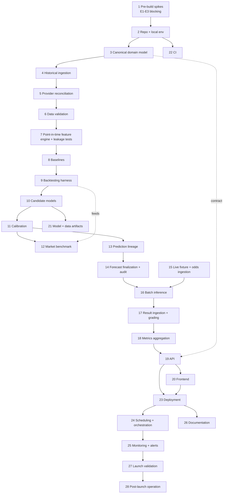

# SoccerEdge Implementation Plan and Backlog Version 1.0

**Derived from:** V2.0 spec · Dependency Verification · Build Contract v2.1 · ML Experimental Protocol v1.0.
**Audience:** one developer, AI-assisted. **No application code in this document.**
**Sequencing principle:** by dependency, not document order; data + methodology risk first; no frontend before data/model interfaces are stable; no cloud before pipelines run locally; no optional infra before the MVP path works.
**Ticket size:** each ≤ ~1 focused session (≈2–4 h). Effort shown as **O / M / P** hours (optimistic / most-likely / pessimistic). AI assistance does **not** remove debugging, research, integration, deployment, or validation time.

---

## 1. Dependency graph (epic level)

**Reads as:** the spine SPIKE→DM→HIST→REC→VAL→FEAT→BASE→HARN→MODL→CAL→LIN→FIN→INF→GRADE→METR→API is the critical path. LIVE ingestion joins at INF. Frontend, Terraform/Deploy, CI, docs, and artifacts hang off stable points and parallelize.

---

## 2. Milestone table

| ID | Milestone | Entry criteria | Exit criteria |
|---|---|---|---|
| **M0** | External deps verified | Spikes scoped | E1–E3 GO/NO-GO recorded with evidence; data plan fixed |
| **M1** | Historical dataset trustworthy | Schema exists; loader runs | MLS 2017–2025 normalized, reconciled, validated; DQ + dedupe tests pass |
| **M2** | Leakage-safe features | Clean dataset | fs-v1 builds per match; **all leakage tests pass** (recompute parity, Elo-order, cutoff) |
| **M3** | Baselines evaluated | Features + harness | B0–B5 scored on walk-forward with CIs; RQ1–RQ2 recorded |
| **M4** | Model + calibration selected | Baselines done | Champion chosen on dev (RQ3/RQ4/RQ7); calibration decision (RQ5); selection frozen + committed |
| **M5** | Predict + grade loop works locally | Selected pipeline | Official write-once forecast + event ledger + hash; grading + metrics recompute; audit tests pass |
| **M6** | Public API works | Metrics in DB | All endpoints return correct data; contract/pagination/freshness tests pass |
| **M7** | Dashboard works | Stable API | All pages + states render; evidence types separated; e2e passes |
| **M8** | Production pipeline deployed | Local loop green | Terraform apply; jobs scheduled; CI green; alarms fire on induced failure; cost ≤ $5/mo |
| **M9** | First official live prediction finalized | Deployed + resumption fixtures | A real fixture's official forecast finalizes, freezes, hashes, anchors before kickoff |
| **M10** | First official live prediction graded | M9 + a played match | That forecast is graded; metrics_snapshot updates from immutable data |

---

## 3. Full epic list

| Epic | Scope | Milestone |
|---|---|---|
| E01 Pre-build spikes | E1–E3 blocking + data/infra spikes; go/no-go each | M0 |
| E02 Repo + local env | Monorepo, Docker Compose, config/secrets, CI skeleton | — |
| E03 Canonical domain model | Schema + migrations + data-access + write-once enforcement | — |
| E04 Historical ingestion | football-data.co.uk loader, normalize, playoff filter | M1 |
| E05 Provider reconciliation | Team-alias map, conflict logging | M1 |
| E06 Data validation | Validation gates, quarantine, DQ tests | M1 |
| E07 Feature engine | Elo, form, rest/context, fs-v1 builder, **leakage tests** | M2 |
| E08 Baselines | B0–B5 | M3 |
| E09 Backtesting harness | Walk-forward, metrics, bootstrap, run logging | M3 |
| E10 Candidate models | Logistic + ablation, LightGBM, selection runner | M4 |
| E11 Calibration | Temperature scaling, OOF evaluation | M4 |
| E12 Market benchmark | Historical closing-odds (aggregate); conditional live | M4 |
| E13 Prediction lineage | prediction_run, registry, dataset/training snapshots | M5 |
| E14 Forecast finalization + audit | Write-once + ledger + hash + anchor, finalization job, audit tests | M5 |
| E15 Live fixture + odds ingestion | API-Football, Highlightly backup, conditional odds, failover | M9 |
| E16 Batch inference | Inference job, idempotency/state-gating | M5/M9 |
| E17 Result ingestion + grading | Grading, regrading, grading tests | M10 |
| E18 Metrics aggregation | Snapshot recompute, evidence separation | M10 |
| E19 API | Endpoints, packaging, tests | M6 |
| E20 Frontend | Scaffold/components, pages, methodology, e2e | M7 |
| E21 Model + data artifacts | Model card, data card | M8 |
| E22 CI | Gates, build/publish | M8 |
| E23 Deployment | Terraform core/compute/observability, Neon prod, smoke | M8 |
| E24 Scheduling + orchestration | EventBridge schedules, choreography + locks | M8 |
| E25 Monitoring + alerts | Operational/DQ/model monitors, runbook | M8 |
| E26 Documentation | README, ADRs | M8 |
| E27 Launch validation | Touch-once test run, live-loop arm, launch checklist | M9 |
| E28 Post-launch operation | First-grade verify, retrain dry-run; post-MVP placeholders | M10+ |

---

## 4. Full ticket backlog

Format per ticket: **ID — Title** `[MVP/Post · Risk · O/M/P h]` · Obj/Why · In→Out · Do · Deps · AC · Tests · Fail/Stop · Doc. (T-001…T-010 are expanded in §14.)

### E01 — Pre-build spikes (M0)
- **T-001 — Spike E1: playoffs in historical file** `[MVP·H·1/2/3]` — see §14.
- **T-002 — Spike E2: current-season MLS on free tier** `[MVP·H·1/2/4]` — see §14.
- **T-003 — Spike E3: free MLS three-way odds + display ToS** `[MVP·M·1/2/3]` — see §14.
- **T-004 — Spike: historical odds suitability + coverage** `[MVP·M·1/2/3]` — see §14.
- **T-005 — Spike: team-name reconciliation dry-run** `[MVP·M·1/2/3]` — see §14.
- **T-006 — Spike: Lambda dependency size** `[MVP·M·1/2/4]` · Obj: confirm sklearn+lightgbm+statsmodels+pandas image deploys to Lambda. In→Out: deps list → ECR image + cold-start measurement + decision note. Do: build container image, push to ECR, deploy a no-op handler, measure cold start. Deps: T-010. AC: image <10 GB; cold start recorded; go/no-go on container-vs-PaaS. Tests: invoke deployed function returns 200. Fail/Stop: image >10 GB or cold start >10 s → escalate to PaaS fallback. Doc: spike note.
- **T-007 — Spike: Neon connection strategy** `[MVP·M·1/1/3]` · Obj: confirm Neon pooled (PgBouncer) transaction-mode endpoint works from a Lambda-like context outside a VPC. In→Out: Neon project → working connection + pool config. Do: connect via psycopg to the pooled endpoint; run concurrent short queries; verify scale-to-zero wake. Deps: T-010. AC: connections succeed; no "too many clients" under burst; wake <2 s. Tests: concurrency smoke. Fail/Stop: pooling unreliable → Supabase fallback. Doc: spike note.
- **T-008 — Spike: sample-size, era start, calibration sufficiency** `[MVP·M·1/2/3]` — see §14.

### E02 — Repo + local env
- **T-010 — Repo scaffold + tooling** `[MVP·L·2/3/5]` — see §14.
- **T-011 — Docker Compose local stack** `[MVP·L·1/2/4]` — see §14.
- **T-012 — Config + secrets abstraction** `[MVP·L·1/2/3]` — see §14.
- **T-013 — CI skeleton** `[MVP·L·1/2/3]` · Obj: GitHub Actions runs lint+type+unit on PR. In→Out: repo → `ci.yml`. Do: ruff, mypy, pytest, frontend lint; cache deps; required check. Deps: T-010. AC: PR fails on lint/type/test error. Tests: a deliberately broken PR is blocked. Fail/Stop: none. Doc: CONTRIBUTING note.

### E03 — Canonical domain model
- **T-020 — Core schema + migrations** `[MVP·M·2/3/5]` — see §14.
- **T-021 — Audit/ops schema** `[MVP·M·2/3/5]` · Obj: add prediction (write-once), prediction_event, prediction_run, prediction_grade, metrics_snapshot, model_version, model_artifact, calibration_artifact, training_run, dataset_snapshot, job_run, draft_prediction, staging_rejects. In→Out: ERD → Alembic migration. Do: FKs; partial unique index `model_version(is_production) where is_production`; market_snapshot unique(match,provider,capture_time). Deps: T-020. AC: migration up/down clean; constraints enforced. Tests: insert/constraint tests; one-production-model-per-league enforced. Fail/Stop: none. Doc: schema doc.
- **T-022 — Data-access layer + write-once guard** `[MVP·M·2/3/4]` · Obj: typed repo; INSERT-only for `prediction`; advisory-lock helper; idempotency-key helper. In→Out: schema → data-access module. Do: DB role lacking UPDATE on prediction; app guard + test; `pg_advisory_lock` wrapper. Deps: T-020,T-021. AC: UPDATE on a prediction row raises. Tests: write-once + advisory-lock tests. Fail/Stop: none. Doc: data-access README.

### E04 — Historical ingestion (M1)
- **T-030 — football-data.co.uk loader** `[MVP·M·2/3/5]` · Obj: download `new/USA.csv`, snapshot raw + SHA-256. In→Out: URL → raw S3/local file + hash + `dataset_snapshot` stub. Do: fetch with retry; store raw; record fetch time. Deps: T-022. AC: file stored; hash recorded; re-run idempotent. Tests: hash stability; parse smoke. Fail/Stop: file unreachable → use cached copy (fallback). Doc: data-source note.
- **T-031 — Normalize historical rows** `[MVP·M·2/4/6]` · Obj: map CSV → canonical match + market_snapshot. In→Out: raw CSV → `match`, `market_snapshot(is_closing=true)`. Do: parse Date+Time as UTC (flag approximate), Res→H/D/A, PSC*/AvgC*/MaxC* into market_snapshot; natural-key match rows. Deps: T-030,T-040. AC: row counts match file; closing odds attached; H/D/A correct. Tests: result-mapping; odds-parse; row-count parity. Fail/Stop: column drift → fail loudly, do not silently coerce. Doc: normalization mapping.
- **T-032 — Playoff/non-RS filter** `[MVP·M·1/2/4]` · Obj: keep regular-season only per E1 decision. In→Out: normalized rows → filtered RS set. Do: apply date-window/round rule from T-001; tag excluded. Deps: T-031,T-001. AC: known playoff dates excluded; counts plausible per E6. Tests: a known playoff fixture is excluded. Fail/Stop: if E1 NO-GO, restrict to confirmed RS windows; document. Doc: exclusion rule.

### E05 — Provider reconciliation (M1)
- **T-040 — Team-alias map** `[MVP·M·2/3/5]` · Obj: map historical + live names → `team_id`. In→Out: name lists → versioned alias file + `team_alias` rows. Do: curate mapping; handle Chivas USA (defunct), renames/relocations. Deps: T-020,T-005. AC: every historical home/away resolves; unresolved=0. Tests: alias-collision + coverage test. Fail/Stop: unresolved names → block ingestion until mapped. Doc: alias-map README.
- **T-041 — Reconciliation report + conflict logging** `[MVP·L·1/2/3]` · Obj: source-of-truth rules + conflict log. In→Out: dual sources → reconciliation report. Do: football-data.co.uk wins pre-current; live wins current; log mismatches. Deps: T-031,T-040. AC: conflicts logged, not silently dropped. Tests: injected conflict appears in report. Fail/Stop: none. Doc: SoT rules.

### E06 — Data validation (M1)
- **T-050 — Validation gates + quarantine** `[MVP·M·2/3/4]` · Obj: schema/plausibility/dedupe gates → quarantine. In→Out: normalized rows → validated rows + `staging_rejects`. Do: dedupe on natural key; goals≥0; odds>1; overround band; date monotonicity; reject-rate alarm hook (>5%). Deps: T-031. AC: bad rows quarantined with reason. Tests: each gate rejects a crafted bad row. Fail/Stop: reject rate >5% → halt + alarm. Doc: validation rules.
- **T-051 — Data-quality test suite** `[MVP·M·1/2/3]` · Obj: standing DQ checks. In→Out: dataset → DQ report. Do: null rates, duplicate fixtures, alias coverage, missing-matchweek detection. Deps: T-050. AC: suite runs in CI. Tests: the suite itself. Fail/Stop: none. Doc: DQ checklist.

### E07 — Point-in-time feature engine + leakage tests (M2)
- **T-060 — Elo engine** `[MVP·H·3/4/6]` · Obj: chronological Elo per Contract §6.1. In→Out: RS matches → `elo_rating` history + pre-match value. Do: K=20,H=60,MOV multiplier; cross-season regress 0.75; R0=1500; RS-only updates; current match excluded. Deps: T-050. AC: deterministic; pre-match Elo excludes current. Tests: update-order; season-boundary regression; new-team init. Fail/Stop: none. Doc: Elo spec.
- **T-061 — Rolling form features** `[MVP·M·2/4/6]` · Obj: form5/10 pts+gd, home/away form5. In→Out: matches → form features. Do: shift to exclude current; n<k handling; shrink to league mean; spans seasons; RS-only contribute. Deps: T-050. AC: window excludes current match. Tests: rolling-exclusion; shrink-on-cold-start. Fail/Stop: none. Doc: feature defs.
- **T-062 — Rest/congestion/context features** `[MVP·M·2/3/4]` · Obj: rest_days, congestion, season_progress, cold_start, neutral_site. In→Out: matches+schedule → features. Do: rest cap 14; congestion 14d; season_progress from **published schedule**; cold_start<10; neutral flag. Deps: T-050. AC: season_progress uses schedule not realized counts. Tests: season-fraction-no-leak; cold-start flag. Fail/Stop: none. Doc: feature defs.
- **T-063 — fs-v1 builder + versioning** `[MVP·M·2/3/4]` · Obj: assemble `feature_row` per match as-of T-3h. In→Out: feature components → `feature_row(fs-v1)`. Do: join all features; persist with `feature_set_version`. Deps: T-060,T-061,T-062. AC: one row/match; reproducible. Tests: schema/version test. Fail/Stop: none. Doc: fs-v1 registry.
- **T-064 — Leakage test suite (R1–R8)** `[MVP·H·3/4/6]` · Obj: enforce point-in-time safety. In→Out: feature engine → leakage report. Do: recompute-parity vs stored; max(input event_time)<cutoff; Elo excludes current; calibration-slice past-only assertion; no future market_snapshot referenced. Deps: T-063. AC: all assertions pass on a sample. Tests: each R1–R8 assertion + a deliberately-leaky fixture caught. Fail/Stop: any leak → block all downstream work. Doc: leakage-test spec.

### E08 — Baselines (M3)
- **T-070 — B0/B1/B2 base rates** `[MVP·L·2/3/4]` · expanding past-only; AC: probabilities sum to 1, point-in-time; Tests: no-future-rate test; Doc: baseline note. Deps: T-063.
- **T-071 — B3 Elo→1X2** `[MVP·M·2/3/4]` · ordinal logistic link on elo_diff+home; AC: calibrated-ish probs; Tests: monotonic in elo_diff; Deps: T-060,T-080.
- **T-072 — B4 Poisson goal model** `[MVP·M·2/4/6]` · attack/defense strengths → outcome grid; AC: grid sums to 1; Tests: known-fixture sanity; Deps: T-080.
- **T-073 — B5 Dixon-Coles** `[MVP·H·3/5/8]` · low-score correction + time-decay ξ=0.0065/day; AC: draws emerge from goal process; Tests: DC-vs-Poisson difference on low scores; Deps: T-072.

### E09 — Backtesting harness (M3)
- **T-080 — Walk-forward engine** `[MVP·H·3/5/8]` · expanding, 1-matchweek block, refit Elo/preproc/calibration per fold past-only; AC: fold boundaries correct, refit verified; Tests: per-fold-refit (no cross-fold leakage), block boundaries; Deps: T-063,T-064.
- **T-081 — Metrics module** `[MVP·M·2/3/5]` · log loss (clipped), RPS (ordered), Brier, ECE+classwise, accuracy/confusion; per-fold+pooled; AC: formulas match Protocol §8; Tests: metric unit tests vs hand-computed; Deps: T-080.
- **T-082 — Block-bootstrap uncertainty** `[MVP·M·2/3/4]` · matchweek blocks, 2000 resamples, 95% CI, paired diffs, by-season robustness; AC: CI reproducible with seed; Tests: bootstrap determinism; Deps: T-081.
- **T-083 — Experiment-run logging** `[MVP·M·1/2/3]` · record Protocol §12 fields, append-only; AC: every run persisted with snapshot+SHA+seed; Tests: run-record completeness; Deps: T-080.

### E10 — Candidate models (M4)
- **T-090 — Logistic + F0–F4 ablation** `[MVP·M·2/4/6]` · L2, standardized per fold, C∈{.01,.1,1,10}×F0–F4; select smallest F-set within threshold; AC: ≤20 configs, selection logged; Tests: standardization-fit-past-only; Deps: T-080.
- **T-091 — LightGBM challenger (E4)** `[Post-MVP-default·M·2/4/6]` · ≤12 configs, early stopping; ships only if it clears the gate; default not ship; AC: config cap enforced; Tests: determinism with seed; Deps: T-080. **Removable (scope ladder).**
- **T-092 — Selection runner (promotion gates)** `[MVP·M·2/3/5]` · apply Protocol §10 matrix on dev; pick champion; AC: champion + runner-up recorded, gates evaluated; Tests: gate logic unit tests (≥0.005 & CI-excludes-0 & ECE tol); Deps: T-082,T-090,T-100.

### E11 — Calibration (M4)
- **T-100 — Temperature scaling** `[MVP·M·2/3/4]` · per fold on trailing-20% slice; sample floor ≥150/≥30 draws; fallback uncalibrated; AC: T learned per fold, fallback path tested; Tests: sum-to-one, degenerate-fit fallback; Deps: T-080.
- **T-101 — Calibration evaluation (RQ5)** `[MVP·M·1/2/3]` · OOF reliability + ECE pre/post + CIs; adopt only if not-worse OOF; AC: decision recorded out-of-fold; Tests: ECE computation; Deps: T-100,T-081.

### E12 — Market benchmark (M4; conditional)
- **T-110 — Historical closing-odds benchmark** `[MVP·M·2/3/4]` · vig removal (proportional); model-at-cutoff vs market-closing on odds-intersection subset; aggregate metrics + selection-bias note; label stronger-information reference; AC: subset size reported, no raw-odds redistribution; Tests: vig-removal sums to 1, match-set parity; Deps: T-031,T-081.
- **T-111 — Live odds interface (conditional E3)** `[MVP-if-E3·L·1/2/3]` · interface only; capture nearest T-3h; if E3 NO-GO leave unimplemented. AC: stubbed cleanly; Tests: interface contract; Deps: T-003. **Removable.**

### E13 — Prediction lineage (M5)
- **T-120 — prediction_run + lineage capture** `[MVP·M·2/3/4]` · record dataset_snapshot, fs-v1, model_version, calibration, code SHA, seed, freshness, inputs hash; AC: every run fully traceable; Tests: lineage-completeness; Deps: T-022,T-121.
- **T-121 — Registry: dataset/training/model_version** `[MVP·M·2/3/5]` · S3 artifacts + Postgres metadata; is_production flag; AC: artifact round-trips; one prod model/league; Tests: registry round-trip, promotion flag; Deps: T-021.

### E14 — Forecast finalization + audit (M5)
- **T-130 — Write-once prediction + event ledger** `[MVP·H·2/4/6]` · INSERT-only official row; append Finalized/Frozen/… events; post-kickoff rejection; AC: no mutation possible; Tests: write-once, post-kickoff-write-rejected; Deps: T-022.
- **T-131 — Hashing + public-Git anchor** `[MVP·H·3/4/7]` · SHA-256 canonical JSON (sorted keys); push to `anchors/YYYY-MM-DD.jsonl` at creation; daily Merkle root 12:00 UTC; AC: hash reproducible, anchor predates kickoff; Tests: hash determinism, anchor-before-kickoff; Fail/Stop: Git push fails → retry then alarm (forecast still recorded); Deps: T-130.
- **T-132 — Finalization job logic** `[MVP·H·3/5/8]` · at T-3h: features→predict→calibrate→freshness check→write official→freeze→hash→anchor; draft generation for 7-day window; AC: one official/fixture at T-3h; drafts never graded/hashed; Tests: cutoff-trigger, draft-not-graded, freshness-reject; Deps: T-130,T-131,T-150.
- **T-133 — Audit/freeze test suite** `[MVP·H·2/3/5]` · supersession on postponement (void+new), corrected→regrade, hash match; AC: full audit invariants hold; Tests: supersession, regrade-retains-original; Deps: T-132.

### E15 — Live fixture + odds ingestion (M9)
- **T-140 — API-Football adapter** `[MVP·M·2/4/6]` · fixtures/results/rounds/status/team-ids; raw snapshot; AC: current MLS season returns; ids mapped; Tests: schema-contract, status mapping; Fail/Stop: per E2; Deps: T-002,T-040.
- **T-141 — Highlightly backup adapter** `[MVP·M·2/3/5]` · same interface; failover; AC: produces identical canonical rows; Tests: parity with primary; Deps: T-140.
- **T-142 — Live odds adapter (conditional E3)** `[MVP-if-E3·M·2/3/5]` · capture near T-3h → market_snapshot; AC: timestamped snapshot; Tests: capture-window; Deps: T-003. **Removable.**
- **T-143 — Provider-failure handling** `[MVP·M·2/3/4]` · 3 retries 5/25/125s → failover → last-known serve + freshness flag; AC: site never blocks on outage; Tests: simulated outage degradation; Deps: T-140,T-141.

### E16 — Batch inference (M5/M9)
- **T-150 — Inference job (container handler)** `[MVP·H·3/4/6]` · load prod model read-only; build cutoff features; predict+calibrate; write prediction_run; AC: reads registry (never writes); Tests: read-only-registry, prob-validity; Deps: T-092,T-121,T-063.
- **T-151 — Idempotency + state-gating** `[MVP·M·2/3/4]` · only fixtures crossing T-3h w/o official; advisory lock; 36h freshness gate; stale flag; AC: re-run = no duplicate official; Tests: idempotency, freshness-gate; Deps: T-150,T-022.

### E17 — Result ingestion + grading (M10)
- **T-160 — Grading job** `[MVP·M·2/3/5]` · fetch finals for past-kickoff ungraded; compute log loss/RPS/Brier/correct; write grade; append Graded; AC: only official forecasts graded; Tests: grading-correctness, idempotent; Deps: T-140,T-130.
- **T-161 — Regrading on correction** `[MVP·M·1/2/4]` · result_version; append Regraded; retain original; AC: latest grade used in metrics, original retained; Tests: regrade-retains-original; Deps: T-160.
- **T-162 — Grading test suite** `[MVP·M·1/2/3]` · duplicate-grade prevented; result mapping; AC: suite in CI; Tests: as named; Deps: T-160.

### E18 — Metrics aggregation (M10)
- **T-170 — metrics_snapshot recompute** `[MVP·M·2/3/4]` · from immutable graded data; overall/rolling/by-month/by-confidence; model+market; AC: derived only from grades; Tests: recompute determinism; Deps: T-160.
- **T-171 — Evidence separation** `[MVP·M·1/2/3]` · dev/test/backtest/live scopes never merged; AC: each metric tagged by evidence type; Tests: scope-tag enforcement; Deps: T-170.

### E19 — API (M6)
- **T-180 — FastAPI endpoints** `[MVP·M·2/4/6]` · /health,/leagues,/matches/upcoming,/matches/{id},/predictions/completed,/performance?scope,/calibration,/model-versions,/methodology; AC: correct data, evidence-scoped; Tests: contract+pagination+filters; Deps: T-170.
- **T-181 — API packaging** `[MVP·M·2/3/5]` · slim zip + Mangum + API GW HTTP; throttle 20/s burst 40; CORS; AC: deploys as zip <250 MB, no ML libs; Tests: cold-start, CORS; Deps: T-180.
- **T-182 — API test suite** `[MVP·M·1/2/3]` · contracts, freshness, error states; AC: in CI; Deps: T-180.

### E20 — Frontend (M7)
- **T-190 — Scaffold + components** `[MVP·M·2/4/6]` · React+Vite+TS+Recharts; ProbabilityBar, MatchCard, ProvenanceLine, ReliabilityDiagram, MetricScorecard, FreshnessIndicator, states; AC: components render with mock data; Tests: component tests; Deps: T-180 (contract).
- **T-191 — Upcoming + Match detail** `[MVP·M·2/3/5]` · official + draft labeled; provenance; aggregate market; AC: shows frozen-at + model version; Tests: render+states; Deps: T-190.
- **T-192 — Performance + archive** `[MVP·M·2/4/6]` · evidence separation; reliability diagram; filterable archive; CIs + sample sizes; AC: dev/test/backtest/live visibly separated; Tests: filter + chart render; Deps: T-190.
- **T-193 — Methodology/limitations + states + e2e** `[MVP·M·2/3/4]` · "not betting advice"; stale/error states; AC: empty/loading/stale/error all handled; Tests: Playwright happy path; Deps: T-191,T-192.

### E21 — Model + data artifacts (M8)
- **T-200 — Model card + data card** `[MVP·L·2/3/4]` · intended use, era/exclusions, metrics+evidence+CIs, calibration, limitations, non-gambling, licensing, reproducibility scope; AC: both published; Tests: n/a (review); Deps: T-092,T-110.

### E22 — CI (M8)
- **T-210 — CI gates** `[MVP·M·1/2/3]` · lint+type+unit+DQ+**leakage** required; gitleaks + pip/npm audit; AC: merge blocked without leakage tests green; Tests: broken-PR blocked; Deps: T-064,T-013.
- **T-211 — Build/publish workflows** `[MVP·M·2/3/5]` · API zip, job container→ECR, frontend build; AC: artifacts published on merge; Tests: workflow dry-run; Deps: T-181,T-150.

### E23 — Deployment (M8)
- **T-220 — Terraform core + observability** `[MVP·H·3/5/8]` · S3 raw+registry, ECR, CloudFront+S3 site, IAM least-priv, SSM params, Budgets $5, CloudWatch logs 14d, alarms→SNS; AC: `terraform apply` clean; Tests: plan in CI; Deps: T-006.
- **T-221 — Terraform compute** `[MVP·H·3/5/8]` · Lambda zip API + API GW; Lambda container jobs; EventBridge; **no VPC**; AC: functions live, reachable; Tests: smoke invoke; Deps: T-220,T-181,T-150.
- **T-222 — Neon prod + deploy smoke** `[MVP·M·2/4/6]` · pooled endpoint; migrations on deploy; dev branch; end-to-end smoke; AC: /health green in prod; induced provider failure → last-known + alarm; Tests: prod smoke; Deps: T-007,T-221.

### E24 — Scheduling + orchestration (M8)
- **T-230 — EventBridge schedules** `[MVP·M·2/3/4]` · ingest 08/20, features hourly, inference hourly, grade 2h, odds hourly (E3), Merkle 12:00, retrain monthly (GH Actions); AC: rules created, fire on time; Tests: schedule firing; Deps: T-221.
- **T-231 — Choreography + advisory locks** `[MVP·M·2/3/5]` · job prerequisites via DB state; idempotency keys; job_run records; AC: out-of-order trigger no-ops safely; Tests: race/idempotency; Deps: T-151,T-230.

### E25 — Monitoring + alerts (M8)
- **T-240 — Monitors (op/DQ/model)** `[MVP·M·2/3/5]` · job success/duration; stale flags; reject rate; PSI>0.2 investigate; prob validity; rolling log loss (label-lagged); AC: alarms wired to SNS; Tests: induced-failure alarm; Deps: T-222.
- **T-241 — Runbook** `[MVP·L·1/2/3]` · alert→response; AC: each alarm has a documented response; Doc: runbook; Deps: T-240.

### E26 — Documentation (M8)
- **T-250 — README** `[MVP·M·2/3/4]` · problem, architecture diagram, how-to-run, results-with-caveats, limitations, roadmap; AC: a second dev can run it; Deps: T-222.
- **T-251 — ADRs** `[MVP·L·1/2/3]` · Neon, no-VPC, logistic, temperature, choreography, market-aggregate-only; AC: each frozen decision has an ADR; Deps: T-250.

### E27 — Launch validation (M9)
- **T-260 — Touch-once 2025 test run** `[MVP·H·2/3/5]` · execute Protocol §14 checklist; run the single 2025 test; record immutably; AC: checklist fully ticked; one-pass result stored; Tests: checklist gate; Fail/Stop: if not all boxes ticked, **do not run**; Deps: T-092,T-101,T-082.
- **T-261 — Live-loop arm on resumption fixtures** `[MVP·H·2/4/6]` · first real official forecast finalizes/freezes/hashes/anchors before kickoff; AC: anchor visible in public repo pre-kickoff; Tests: end-to-end on a real fixture; Deps: T-132,T-222,T-230.
- **T-262 — Launch checklist** `[MVP·M·1/2/3]` · V2 §42 (URL https, mobile, evidence separation, methodology, demo video); AC: all items pass; Deps: T-193,T-261.

### E28 — Post-launch operation (M10+)
- **T-270 — First live grading verification** `[MVP·M·1/2/3]` · first official forecast graded; metrics update; AC: live metric appears, labeled live; Deps: T-160,T-261.
- **T-271 — Monthly retrain + promotion dry-run** `[MVP·M·2/3/4]` · GH Actions retrain → challenger; manual promotion flow exercised; AC: challenger produced, promotion logged or rejected per gate; Deps: T-092,T-121.
- **T-272 — Post-MVP placeholders** `[Post·—·—]` · drift dashboards, odds-aware model, SHAP, La Liga, isotonic/Dirichlet, score-distribution DC, over/under & BTTS. **Not MVP; not in resume past-tense until built.**

---

## 5. Critical path

**Blocks the entire project (must be serial):**
T-001/T-002 (data feasibility) → T-010/T-011/T-012 (env) → T-020/T-021/T-022 (schema) → T-030/T-031 (ingest) → T-040 (alias) → T-050 (validation) → T-060/T-061/T-062/T-063 (features) → **T-064 (leakage tests)** → T-080 (walk-forward) → T-081/T-082 (metrics+CI) → T-090/T-100/T-092 (model+calibration+selection) → T-120/T-121 (lineage) → T-130/T-131/T-132 (finalization+audit) → T-150/T-151 (inference) → T-160 (grading) → T-170 (metrics) → T-180/T-181 (API) → T-220/T-221/T-222 (deploy) → T-230/T-231 (schedule) → T-260/T-261 (launch).

**Single biggest schedule risks:** T-040 reconciliation (messy names), T-073 Dixon-Coles, T-080 walk-forward correctness, T-131/T-132 hashing+anchor+finalization, T-220/T-221 Terraform, T-140 live-provider integration.

---

## 6. Parallel-work opportunities

- After **T-020/T-022**: ingestion (T-030/031) and the alias map (T-040) progress together; baselines B0–B2 (T-070) need only results.
- Baselines **T-071/072/073** parallelize once features+harness exist.
- **API (T-180)** can be built against mock data once the schema/contract exists; **frontend scaffold (T-190)** starts against the OpenAPI contract — but frontend *pages* wait for real endpoints (rule honored).
- **Terraform (T-220)** and **CI (T-210/211)** are authored in parallel with the model spine but **applied only after the local loop is green**.
- **Model card / ADRs / README (T-200/250/251)** drafted alongside development.
- **Monitoring/runbook (T-240/241)** built with deployment.

---

## 7. Risk spikes (each ends in go/no-go + evidence)

| Spike | Question | Go | No-go fallback | Box |
|---|---|---|---|---|
| T-001 | Playoffs in `new/USA.csv`? filterable? | absent/filterable → proceed | confirmed RS windows only | go/no-go note |
| T-002 | Current MLS season free on API-Football/Highlightly? | returns → API-Football primary | re-scope league (escalate) | evidence + ids |
| T-003 | Free MLS three-way odds + display ToS? | yes → live same-cutoff IN | drop live; historical closing-odds only | ToS + sample |
| T-004 | Historical odds coverage/suitability (closing-only, no timestamps) | enough matches w/ odds → benchmark IN | market optional/internal | coverage count |
| T-005 | Team-name reconciliation feasible? | unresolved→0 with effort | manual mapping; block ingest until done | unresolved list |
| T-006 | ML deps fit Lambda container? | <10 GB, cold start ok | PaaS fallback (Render/Fly) | image size + timing |
| T-007 | Neon pooled endpoint from no-VPC Lambda? | stable under burst | Supabase fallback | concurrency log |
| T-008 | Clean matches/season + draw counts; 2017 era ok? | ≥150/≥30 draws per calib slice | extend era / widen CIs | per-season table |

---

## 8. Testing matrix

| Test type | Where | Tickets |
|---|---|---|
| **Leakage (highest priority)** | feature engine, harness | T-064, T-080 (per-fold refit) |
| Unit (Elo, form, metrics, vig) | features, metrics, market | T-060/061/062, T-081, T-110 |
| Data-quality | ingestion/validation | T-050, T-051 |
| Reconciliation | alias/conflict | T-040, T-041 |
| Schema/constraint/write-once | domain model | T-020/021/022 |
| Statistical determinism | bootstrap | T-082 |
| Calibration (sum-to-one, fallback, OOF) | calibration | T-100, T-101 |
| Audit/freeze (write-once, post-kickoff, hash, supersession, regrade) | finalization/grading | T-133, T-130, T-131, T-161 |
| Idempotency / state-gating / race | inference/orchestration | T-151, T-231, T-160 |
| Provider outage degradation | live ingestion | T-143 |
| API contract/pagination/freshness | API | T-182 |
| Frontend component + e2e | frontend | T-190…T-193 |
| Reproducible training | registry/lineage | T-120, T-121 |
| Deploy smoke + induced-failure alarm | deploy/monitoring | T-222, T-240 |
| Migration up/down | schema | T-020, T-021 |

---

## 9. Documentation matrix

| Artifact | Owner ticket | When |
|---|---|---|
| Spike go/no-go notes | T-001…T-008 | M0 |
| Data-source + normalization + SoT notes | T-030/031/041 | M1 |
| Alias-map README | T-040 | M1 |
| fs-v1 feature registry + leakage-test spec | T-063, T-064 | M2 |
| Baseline + model + calibration notes | T-070…T-101 | M3–M4 |
| Model card + data card | T-200 | M4/M8 |
| Schema + data-access docs | T-020/021/022 | — |
| ADRs (frozen decisions) | T-251 | M8 |
| README (run + results + limitations) | T-250 | M8 |
| Runbook (alert→response) | T-241 | M8 |
| Launch checklist record | T-262 | M9 |

---

## 10. Scope-reduction ladder (cut in this order if behind)

Preserve, in priority order: **(1) methodological validity → (2) prediction integrity → (3) automated grading → (4) reproducibility → (5) a usable public demo.** Cut from the top:

1. **Visual polish** — extra pages, charts beyond the reliability diagram, theming, animations. (T-192 trims; keep one performance view.)
2. **Optional infra** — custom domain, canary, fancy alarms; drift monitoring (already post-MVP).
3. **Live same-cutoff market (E3 path)** — T-111/T-142; keep the historical closing-odds benchmark, or drop market to internal-only.
4. **LightGBM experiment** — T-091; ship logistic.
5. **AWS deployment** — fall back to **PaaS (Render/Fly.io) + GitHub Actions scheduler** (T-220/221/222 replaced by a simpler deploy). Preserves the live loop and the public demo at lower resume value.
6. **Reduce live-loop breadth** (fewer fixtures) — last resort.

**Never cut:** leakage prevention (T-064), walk-forward + touch-once test (T-080/T-260), write-once + hash audit (T-130/131), automated grading (T-160), evidence separation (T-171), reproducible lineage (T-120/121).

---

## 11. Week-by-week plan (~15 h/week; buffer in week 4)

- **Week 1 — Foundation & data (M0→M1, start M2):** T-001…T-005, T-008 (spikes) · T-010/011/012/013 (env) · T-020/021/022 (schema) · T-030/031/032 (ingest) · T-040/041 (reconcile) · T-050/051 (validate) · start T-060 (Elo).
- **Week 2 — Methodology spine (M2→M4):** T-060/061/062/063 · **T-064 (leakage tests)** · T-070…T-073 (baselines) · T-080/081/082/083 (harness) · T-090/100/101/092 (model+calibration+selection) · T-110 (historical market) · T-200 (cards draft).
- **Week 3 — Loop + API (M5→M6, start M7):** T-120/121 (lineage) · T-130/131/132/133 (finalization+audit) · T-140/141/143 (live ingest) · T-150/151 (inference) · T-160/161/162 (grading) · T-170/171 (metrics) · T-180/181/182 (API) · start T-190 (frontend scaffold).
- **Week 4 — Frontend, deploy, launch (M7→M10) + buffer:** T-191/192/193 (frontend) · T-210/211 (CI) · T-220/221/222 (deploy) · T-230/231 (schedule) · T-240/241 (monitoring) · T-250/251 (docs) · **T-260 (run touch-once 2025 test once)** · T-261/262 (arm live loop, launch) · T-270 (first grade). Buffer absorbs reconciliation/Terraform overruns.

---

## 12. Effort estimate (honest)

Bottom-up roll-up (hours):

| Block | O | M | P |
|---|---|---|---|
| Spikes (E01) | 8 | 14 | 26 |
| Env + schema (E02–E03) | 10 | 16 | 28 |
| Ingest + reconcile + validate (E04–E06) | 12 | 20 | 32 |
| Features + leakage (E07) | 12 | 18 | 30 |
| Baselines + harness (E08–E09) | 16 | 26 | 44 |
| Models + calibration + market (E10–E12) | 11 | 19 | 33 |
| Lineage + finalization + audit (E13–E14) | 12 | 20 | 36 |
| Live ingest + inference + grading + metrics (E15–E18) | 15 | 24 | 42 |
| API + frontend (E19–E20) | 16 | 28 | 48 |
| CI + deploy + schedule + monitor (E22–E25) | 16 | 28 | 50 |
| Artifacts + docs (E21, E26) | 6 | 10 | 16 |
| Launch + post-launch (E27–E28) | 6 | 11 | 20 |
| **Total** | **~140** | **~234** | **~405** |

**Honest reconciliation with the 45–60 h target:** the *fully rigorous* MVP as specified is realistically **~150–240 h** of solo work even AI-assisted — AI speeds boilerplate and first drafts but not the debugging, data reconciliation, leakage-verification, deployment, and integration that dominate this build. The original 45–60 h figure covers only a **reduced slice**. Two honest options: **(a)** extend the calendar to ~6–10 part-time weeks for the full scope; or **(b)** apply the scope-reduction ladder (drop LightGBM, live odds, full AWS → PaaS, frontend to one performance view) to land a **still-methodologically-valid** MVP in ~70–100 h. Recommendation: protect the rigor spine, take option (b) if the calendar is firm, and present the reduced build honestly.

---

## 13. Definition of MVP complete

- [ ] E1–E3 spikes resolved; data plan fixed (M0).
- [ ] MLS 2017–2025 ingested, reconciled, validated; **leakage tests pass** (M1–M2).
- [ ] Baseline ladder B0–B5 + champion model evaluated on expanding walk-forward, **log loss primary**, with calibration and block-bootstrap CIs; **2025 touch-once test run exactly once** and reported with all metrics (M3–M4).
- [ ] One **official forecast/fixture** at T-3h, **write-once**, hashed, publicly anchored before kickoff; **cannot be altered after kickoff** (test-proven); automated, idempotent **grading** (M5).
- [ ] Metrics derive from immutable graded data; **dev/test/backtest/live separated** in API and UI.
- [ ] Read-only API + dashboard render all pages/states; market shown **aggregate only** (if available) (M6–M7).
- [ ] Deployed on AWS via Terraform (Lambda no-VPC, Neon, S3, CloudFront, EventBridge, CloudWatch, SSM); CI green; alarms fire; cost ≤ $5/mo (M8).
- [ ] README + model card + data card published.
- [ ] Live loop **armed and verified** on a real resumption fixture; first official forecast **graded** (M9–M10).
- [ ] **No criterion is conditioned on a particular accuracy result.**

---

## 14. Exact first ten implementation tickets

**T-001 — Spike E1: are MLS playoffs in the historical file, and how are they filtered?**
- *Objective:* determine whether `new/USA.csv` contains MLS Cup playoff matches and a clean rule to exclude them. *Why:* the Contract excludes playoffs but the file has no stage/round column; training on mixed competitions biases league-strength estimates.
- *Inputs:* `https://www.football-data.co.uk/new/USA.csv`; known MLS playoff date windows; API-Football round labels for recent seasons. *Outputs:* a go/no-go note with the filtering rule (date-window and/or round cross-reference) and counts of suspected playoff rows.
- *Implementation requirements:* download the file; group rows by season; compare late-season (Oct–Dec) rows against known regular-season end dates; for ≥2 recent seasons, cross-check against the live API's round labels; decide a deterministic exclusion rule.
- *Dependencies:* none. *Acceptance criteria:* documented rule that excludes playoff matches (or a finding that none are present), with example dates. *Tests:* manual verification that a known MLS Cup final is excluded by the rule. *Failure cases / stop:* if playoffs are present and not cleanly separable → restrict training to confirmed regular-season date windows and document the residual risk. *Effort O/M/P:* 1/2/3 h. *Risk:* High. *Class:* MVP. *Doc:* `docs/spikes/E1-playoffs.md`.

**T-002 — Spike E2: does a free tier return the current 2026 MLS season?**
- *Objective:* confirm API-Football (then Highlightly) free tier returns current-season MLS fixtures and final results, and capture the team-id → alias mapping. *Why:* the live loop has no working source otherwise; football-data.org does not cover MLS.
- *Inputs:* free API keys; MLS league id. *Outputs:* go/no-go note; a saved sample of current-season fixtures/results; an initial team-id map.
- *Implementation requirements:* register key; call `/leagues` to get the MLS id and coverage flags; pull current-season fixtures and a few finalized results; record rate-limit headers; capture team ids/names.
- *Dependencies:* none. *Acceptance criteria:* current-season fixtures and at least one finalized result returned on the free tier; team ids captured. *Tests:* a finalized fixture's score matches an independent source. *Failure cases / stop:* if neither free tier serves current MLS → escalate (re-scope league); do not proceed to live ingestion. *Effort:* 1/2/4 h. *Risk:* High. *Class:* MVP. *Doc:* `docs/spikes/E2-live-mls.md`.

**T-003 — Spike E3: is there a free MLS three-way odds feed, and may it be displayed?**
- *Objective:* determine whether SportsGameOdds (then Highlightly) free tier returns MLS three-way (h2h incl. draw) odds near T-3h, and whether the ToS permit aggregate public display. *Why:* the live same-cutoff market comparison is the only market piece still conditional; The Odds API is paid for MLS.
- *Inputs:* free API keys; provider ToS pages. *Outputs:* go/no-go note; sample odds payload with `last_update`; a ToS finding on aggregate display.
- *Implementation requirements:* request MLS h2h odds; confirm the draw price is present and timestamped; read the ToS for redistribution/display limits.
- *Dependencies:* none. *Acceptance criteria:* a clear decision — live same-cutoff IN (with provider + cadence) or OUT. *Tests:* sample payload contains three outcomes with a timestamp. *Failure cases / stop:* no free MLS three-way or display prohibited → drop the live comparison; keep the historical closing-odds reference (aggregate only). *Effort:* 1/2/3 h. *Risk:* Medium. *Class:* MVP (gates a conditional feature). *Doc:* `docs/spikes/E3-live-odds.md`.

**T-004 — Spike: historical odds suitability and coverage**
- *Objective:* quantify the historical odds: confirm they are closing-only with no capture timestamps, and count the share of MLS matches (2017–2025) with non-null Pinnacle closing odds. *Why:* this fixes the market-comparison subset and the selection-bias caveat, and confirms the "stronger-information reference" framing.
- *Inputs:* the downloaded `new/USA.csv`. *Outputs:* a coverage table (matches with/without `PSCH/PSCD/PSCA` per season) and a confirmation that only closing columns exist.
- *Implementation requirements:* parse the columns; per season, count rows and non-null Pinnacle-closing rows; verify no opening/timestamp columns.
- *Dependencies:* T-001 (same download). *Acceptance criteria:* coverage table produced; subset size known; closing-only confirmed. *Tests:* spot-check a season's odds counts. *Failure cases / stop:* coverage too sparse → drop the historical market benchmark (model-vs-baselines only). *Effort:* 1/2/3 h. *Risk:* Medium. *Class:* MVP. *Doc:* `docs/spikes/E4-odds-coverage.md`.

**T-005 — Spike: team-name reconciliation dry-run**
- *Objective:* build a first-pass alias map between football-data.co.uk team names and live-API team names/ids, and count unresolved names. *Why:* identity reconciliation is the most common silent bug in soccer pipelines; defunct/renamed clubs (e.g., Chivas USA) must be handled.
- *Inputs:* distinct home/away names from `new/USA.csv` (2017–2025); team names/ids from T-002. *Outputs:* a draft `team_alias` file and a list of unresolved/ambiguous names.
- *Implementation requirements:* extract distinct names from both sources; match exact + obvious variants; flag the rest; note relocations/renames.
- *Dependencies:* T-002, T-004. *Acceptance criteria:* an alias draft covering the large majority of names; an explicit unresolved list. *Tests:* every 2017–2025 match's two teams map or appear on the unresolved list. *Failure cases / stop:* none (this informs T-040). *Effort:* 1/2/3 h. *Risk:* Medium. *Class:* MVP. *Doc:* `docs/spikes/team-aliases.md`.

**T-006 — Spike: sample-size, era start, calibration sufficiency (E6)**
- *Objective:* tally clean regular-season MLS matches per season (after the T-001 playoff filter) and the per-season draw counts, to confirm the 2017 era start and that each fold's calibration slice can meet ≥150 matches / ≥30 draws. *Why:* the Protocol's calibration floor and era choice depend on real counts; one season (~500) is a noisy test.
- *Inputs:* filtered historical rows. *Outputs:* a per-season table (matches, H/D/A counts); a confirmation or revision of the 2017 era start and calibration-slice feasibility.
- *Implementation requirements:* group filtered rows by season; count outcomes; estimate the trailing-20% calibration-slice size per fold.
- *Dependencies:* T-001. *Acceptance criteria:* table produced; era and calibration-floor decision recorded. *Tests:* counts reconcile to the filtered total. *Failure cases / stop:* slices too small → extend the era (consider 2015) or widen CIs; record as a protocol note (MINOR version bump). *Effort:* 1/2/3 h. *Risk:* Medium. *Class:* MVP. *Doc:* `docs/spikes/E6-sample-size.md`. *(Backlog id T-008; placed here as one of the first ten by sequence.)*

**T-007 — Repo scaffold + tooling**
- *Objective:* create the monorepo with package boundaries, dependency lockfile, formatting/linting/type-checking, and a pre-commit hook. *Why:* a clean, reproducible structure is the substrate for every later ticket and for reproducibility claims.
- *Inputs:* the Contract's repo structure. *Outputs:* `apps/`, `packages/{ingestion,features,models,common}`, `jobs/`, `infra/`, `tests/`, `docs/`; `pyproject.toml` + lockfile; ruff/mypy config; pre-commit.
- *Implementation requirements:* pin Python 3.12; set up the package layout; configure ruff + mypy; add pre-commit; a placeholder test so `pytest` runs green.
- *Dependencies:* none. *Acceptance criteria:* `pytest` runs (one passing test); lint + type-check pass locally. *Tests:* the placeholder test; lint/type in pre-commit. *Failure cases / stop:* none. *Effort:* 2/3/5 h. *Risk:* Low. *Class:* MVP. *Doc:* `README` skeleton + `CONTRIBUTING`. *(Backlog id T-010.)*

**T-008 — Docker Compose local stack**
- *Objective:* one command brings up Postgres + the app/job container locally. *Why:* the whole pipeline must run locally before any cloud work (sequencing rule).
- *Inputs:* T-007 repo. *Outputs:* `docker-compose.yml` (Postgres + API container + job container), a `.env.example`, and a make target.
- *Implementation requirements:* Postgres service with a persistent volume; the app container builds from the repo; healthchecks; a `make up` / `make migrate` target.
- *Dependencies:* T-007. *Acceptance criteria:* `docker compose up` yields a reachable Postgres and a container that imports the packages. *Tests:* a connection smoke test against the local DB. *Failure cases / stop:* none. *Effort:* 1/2/4 h. *Risk:* Low. *Class:* MVP. *Doc:* local-dev section of the README. *(Backlog id T-011.)*

**T-009 — Config + secrets abstraction**
- *Objective:* a single config layer that reads from env locally and from SSM Parameter Store in cloud, with no secrets in the repo. *Why:* keeps cost at $0 (Parameter Store, not Secrets Manager) and prevents credential leaks.
- *Inputs:* T-007. *Outputs:* a `common.config` module; `.env.example`; a Parameter-Store read path (stubbed locally).
- *Implementation requirements:* typed settings; provider keys + DB URL via env/SSM; gitleaks in pre-commit; never log secrets.
- *Dependencies:* T-007. *Acceptance criteria:* config loads from env locally; missing required keys fail fast with a clear error. *Tests:* config-load test; gitleaks runs. *Failure cases / stop:* none. *Effort:* 1/2/3 h. *Risk:* Low. *Class:* MVP. *Doc:* config + secrets note. *(Backlog id T-012.)*

**T-010 — Core schema + migrations**
- *Objective:* create the core relational schema and the first Alembic migration. *Why:* every downstream ticket reads/writes these tables; the corrected keys (fixture id + revision; natural key for history; no kickoff-date key) prevent the V1 schema bugs.
- *Inputs:* Contract §13/§35 entity model. *Outputs:* tables `league, season, team, team_alias, source_fixture, match, elo_rating, feature_row, market_snapshot`; Alembic up/down.
- *Implementation requirements:* surrogate PKs; `source_fixture` unique (provider, provider_fixture_id, fixture_revision); `match` identified via source_fixture / natural key, **not** kickoff date; `market_snapshot` unique (match, provider, capture_time); UTC columns; indexes per the Contract.
- *Dependencies:* T-007, T-008. *Acceptance criteria:* migration applies and reverts cleanly on the local DB; constraints enforced (e.g., duplicate source_fixture rejected). *Tests:* migration up/down; uniqueness/constraint tests; a postponement (kickoff change) does not create a duplicate match. *Failure cases / stop:* none. *Effort:* 2/3/5 h. *Risk:* Medium. *Class:* MVP. *Doc:* `docs/schema.md`. *(Backlog id T-020.)*

---

**Plan status:** dependency-ordered, risk-front-loaded, every ticket verifiable with tests/validation, fallbacks defined for each external dependency, and scope-reduction triggers set to protect methodological rigor over polish. Start with T-001…T-010 (above); proceed only past M0 once E1–E3 return GO.
