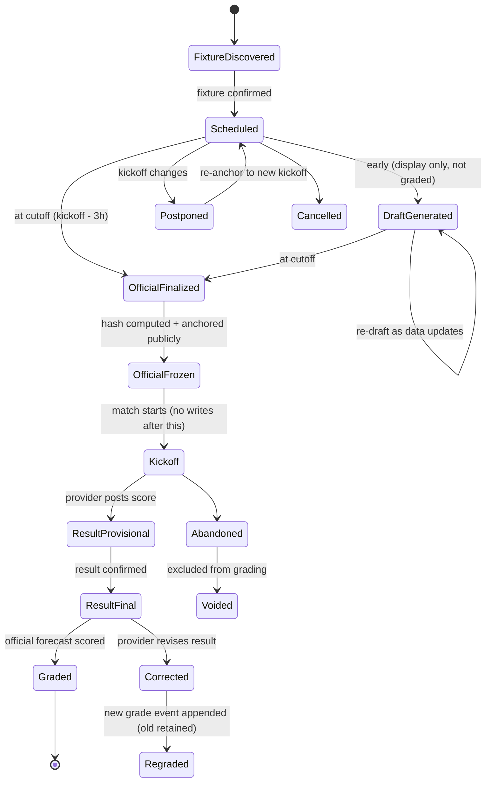
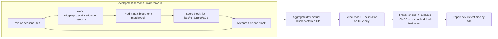
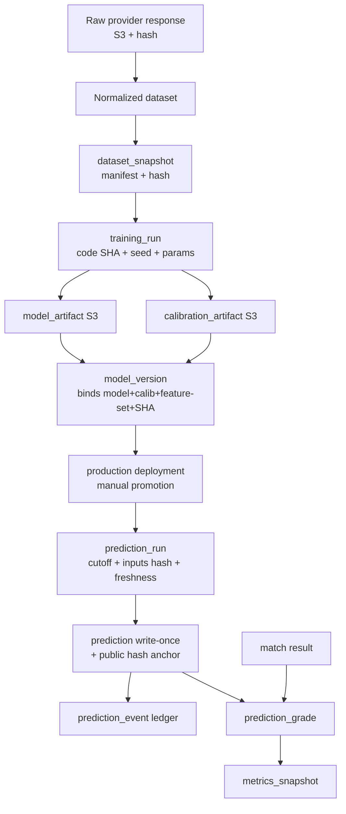
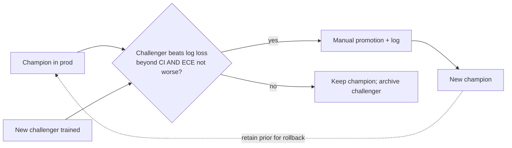
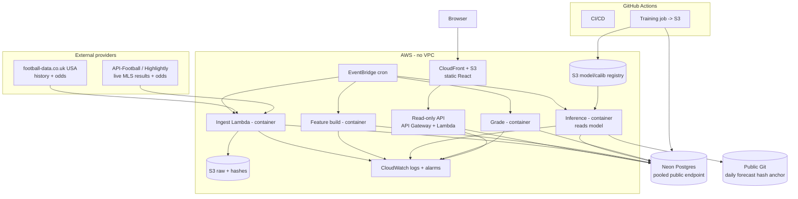

# SoccerEdge — Master Project Specification, Version 2.0

**Version:** 2.0 (corrected after adversarial review)
**Date:** June 14, 2026
**Status:** **Build-ready *after* the pre-build data spike (Review Part 9) returns GO.** All performance, calibration, reproducibility, immutability, and cost claims in this document are **targets to be demonstrated**, not asserted facts.
**One-line:** A serverless system that issues **one official, frozen, hashed** match-outcome forecast per MLS fixture at a defined cutoff, grades it automatically against the result, and publishes an honest, evidence-separated performance record — with the betting market as an optional, fairly-timed, aggregate benchmark.

Supersedes V1.0. Reuses V1.0 content where it survived review; everything flagged Critical/High in the review is corrected here.

---

## Contents
1. Executive summary · 2. Forecasting contract · 3. Match inclusion/exclusion · 4. Official prediction timing · 5. Prediction lifecycle & state machine · 6. Goals · 7. Non-goals · 8. MVP scope · 9. Post-MVP scope · 10. Verified data-source plan · 11. Data fallback strategy · 12. Temporal data model · 13. Entity model · 14. Point-in-time feature definitions · 15. Leakage-prevention rules · 16. Baseline hierarchy · 17. Model-development ladder · 18. Calibration methodology · 19. Temporal validation · 20. Final-test policy · 21. Historical replay policy · 22. Evaluation metrics · 23. Statistical uncertainty · 24. Fair market-comparison protocol · 25. Training pipeline · 26. Batch-inference pipeline · 27. Result-ingestion & grading · 28. Model registry & lineage · 29. Champion-challenger policy · 30. Retraining policy · 31. Monitoring plan · 32. Failure recovery · 33. Architecture · 34. Tech stack · 35. Database design · 36. API design · 37. Testing plan · 38. Security & responsible use · 39. Verified cost estimate · 40. Roadmap · 41. Definition of done · 42. Launch checklist · 43. Model card plan · 44. Data card plan · 45. Interview talking points · 46. Evidence-gated resume bullets · 47. Remaining experiments · 48. Remaining risks. **Diagrams:** architecture, data lineage, temporal backtesting, live lifecycle, state machine, promotion, orchestration DAG.

---

## 1. Executive summary

SoccerEdge issues a single **official forecast** — calibrated home/draw/away probabilities — for each MLS regular-season fixture at a fixed pre-kickoff **cutoff**, using only information available at that cutoff. The official forecast is written once to an immutable record, recorded in an append-only event ledger, and **hashed and anchored publicly before kickoff** so the prediction provably predates the result. After the match, the official forecast is graded automatically; cumulative metrics derive only from immutable, graded records. The market is an **optional aggregate benchmark**, compared fairly (same cutoff), never republished as raw odds, never framed as betting advice.

This is the ML / data-engineering / MLOps flagship of a two-project portfolio (GoDrive carries full-stack/AI). The credibility comes from **rigor and operational integrity** — leakage prevention, a real baseline ladder including Poisson/Dixon-Coles, honest temporal validation, fair benchmarking, and a tamper-evident live loop — not from model exotica. The honest success target is **well-calibrated probabilities competitive with strong baselines, reported with uncertainty**; beating the market is explicitly not claimed.

Timing: both MLS and Europe's leagues are paused for the World Cup during the build window. You **build and backtest during the break and launch into the MLS resumption (~July 16, 2026)**; the live record grows through fall hiring. Budget: ~45–60 h over 3–4 weeks, AI-assisted, gated by the Part 47 data spike.

---

## 2. Forecasting contract

- **Quantity forecast:** P(home win), P(draw), P(away win), summing to 1, for a single official forecast per fixture.
- **Outcome definition:** the **regulation result (90 minutes + stoppage time)**. Extra time and penalty shootouts (knockout contexts) are **excluded** from the outcome — but knockout/playoff matches are excluded from the MVP entirely (§3), so this is precautionary.
- **Target type:** **nominal three-class.** Evaluated primarily with **log loss** (a strict proper scoring rule for nominal outcomes) and secondarily with **RPS**, which treats the outcomes as ordered (home > draw > away, by goal-margin sign); the ordering is stated because RPS rewards "near" misses along that axis. Log loss is authoritative for model selection.
- **What is graded publicly:** exactly **one** official forecast per fixture (the one valid at the cutoff). Drafts are never publicly scored.
- **What the project measures:** **forecasting quality** (calibration + proper scores) and, secondarily, **similarity to the market**. It does **not** measure betting value or profit.

---

## 3. Match inclusion and exclusion

**Included (MVP):** MLS **regular-season** matches only.

**Excluded from training, evaluation, and live prediction:** MLS Cup **playoffs** (single-elimination, different dynamics), **Leagues Cup**, **U.S. Open Cup**, **CONCACAF** competitions, **friendlies/preseason**, and all **international** matches. Rationale: different competitive structure and information; mixing them biases league-strength estimates.

**Edge-case handling:**
- **Abandoned** matches: excluded from grading unless an official result is awarded; flagged.
- **Forfeits / awarded results:** graded only if the provider records an official outcome; flagged as non-standard.
- **Postponed/rescheduled:** the fixture keeps its identity (provider id + revision, §13); the forecast re-anchors to the **actual** kickoff; freeze and cutoff apply to the actual kickoff.
- **Neutral-site** regular-season matches (rare): included, but **home advantage is suppressed** (no home-field term) and flagged.
- **Expansion/cold-start teams:** included with an initialized strength prior and a cold-start flag (§14).

---

## 4. Official prediction timing

- **One official forecast per fixture**, generated at a fixed **cutoff = kickoff − 3 hours** (chosen so confirmed information is stable but a market snapshot is obtainable; the exact offset is finalized in the spike based on odds-capture feasibility).
- **Information cutoff:** features may use only data with event time **< cutoff**.
- **Drafts** may be generated earlier (when fixtures appear) for display, but they are clearly labeled "preliminary" and are **never** the graded forecast. At the cutoff, the official forecast is finalized and frozen.
- **Market snapshot for benchmarking** is captured **at the same cutoff** (§24), so model and market share an information set.
- **After kickoff:** no forecast for that fixture may be created or altered (enforced by write-once record + post-kickoff rejection + hash anchoring; §5, §28).

---

## 5. Prediction lifecycle and state machine

Predictions are **never mutated in place.** An immutable `prediction` row captures the official forecast; all state changes are appended to a `prediction_event` ledger.



- The **official forecast** is the record frozen at the cutoff. Corrections to results append a `Regraded` event; the original grade is retained.
- A failed cutoff job → the fixture has **no official forecast** and is shown as "no forecast issued" (never back-filled after kickoff). A forecast generated on stale features (freshness check fails) is **rejected**, not published.

---

## 6. Goals
Demonstrate, with evidence: leakage-safe point-in-time features; a real baseline ladder (incl. Poisson/Dixon-Coles); honest temporal validation with uncertainty; a fair, cutoff-aligned market benchmark; a tamper-evident freeze-and-grade loop; right-sized MLOps (lineage, registry, monitoring); a clean serverless architecture at ~$0; and responsible, non-gambling communication that separates evidence types.

## 7. Non-goals
Not betting advice; no profit/ROI/units framing. Not beating the closing line. Not multi-league at launch (extensible, not proven). Not exact scores/BTTS/totals/props in MVP. Not post-match features (xG/possession) in MVP. Not user accounts/personalization. Not an elaborate UI. Not in-play prediction. **Not** publishing raw redistributed bookmaker odds.

## 8. MVP scope
MLS regular season; one official 1X2 forecast per fixture at cutoff; leakage-safe features (Elo, rolling form, rest/congestion, context); baseline ladder (base rates → Elo → Poisson → Dixon-Coles) + a primary model (multinomial logistic; GBT only if it clears a significance gate); calibration (logistic-first, then temperature/Dirichlet if needed); expanding walk-forward validation; **log loss primary** + RPS/Brier/ECE/reliability + block-bootstrap CIs; pre-registered touch-once final-test season; optional aggregate market benchmark (cutoff-aligned); write-once prediction record + event ledger + pre-kickoff hash anchoring; automated grading; **labeled backtest** separate from the (initially empty) live record; read-only dashboard; AWS serverless (Lambda outside VPC, container images for ML, Neon, S3, CloudFront, EventBridge, CloudWatch, Terraform; CI/CD + training in GitHub Actions); README, model card, data card.

## 9. Post-MVP scope
Drift monitoring; an odds-aware comparison model (aggregate, clearly separate); SHAP explainability; **La Liga** onboarding (proves extensibility; data is easier — football-data.co.uk history + odds, football-data.org free live); xG features (documented extension point); a fuller Dixon-Coles with time-decay producing score distributions; over/under and BTTS derived from the score model. None appear in past-tense resume bullets until built and measured.

## 10. Verified data-source plan

| Need | Source | Status (verified June 2026) | Cost |
|---|---|---|---|
| Historical results + odds (training + internal market reference) | football-data.co.uk **USA** file | USA page exists; extra-leagues set is 2012→, Pinnacle + market avg/max + closing columns; **last updated May 2024 (2025–26 currency unverified)**; odds are **final, no capture timestamps** | $0 |
| Live MLS fixtures/results | **API-Football** and/or **Highlightly** free | 100 req/day, all endpoints; **historical seasons gated**, current season expected available (confirm in spike) | $0 |
| Live MLS 1X2 odds at cutoff (optional benchmark) | A free odds tier (SportsGameOdds / TheRundown / OddsPapi); Highlightly also bundles odds | Low caps → capture once per fixture at cutoff; **The Odds API free is NBA/MLB-only**, not soccer | $0 |
| La Liga (post-MVP) | football-data.co.uk (SP1) + football-data.org free | football-data.org free **does** cover La Liga; deep odds history | $0 |

**Critical correction vs V1:** football-data.org's free tier does **not** cover MLS; do not use it for MLS.

## 11. Data fallback strategy
- **Min viable plan:** football-data.co.uk USA history (results, possibly limited recent seasons) for training + one free API for current results. Market benchmark optional.
- **Preferred plan:** add a free odds tier capturing a cutoff snapshot per fixture for a fair, aggregate market comparison.
- **If reliable odds are unavailable (spike NO-GO):** market becomes **internal/aggregate only** or is **dropped**; the project ships model-only with baselines. This does not block launch.
- **If MLS historical coverage is inadequate:** restrict the training era to comparable recent seasons, temper claims, and widen reliance on Elo (needs less history).
- **Go/no-go per source** is decided in §47 / Review Part 9.

## 12. Temporal data model
Every record carries the timestamps needed to prove point-in-time safety:

`event_time` (real-world occurrence) · `provider_timestamp` (provider's stated time) · `source_retrieval_time` (our fetch) · `raw_ingestion_time` · `normalization_time` · `feature_as_of_time` (must be < cutoff) · `odds_capture_time` · `forecast_cutoff` · `forecast_creation_time` · `data_freshness_time` (latest input used) · `kickoff_time` · `result_finalization_time` · `grading_time`. Leakage tests assert orderings among these (§15).

## 13. Entity model (corrected)

Core: `league`, `season`, `team`, `team_alias` (provider→internal id), `match`, `elo_rating` (history), `feature_row` (versioned), `model_artifact`, `calibration_artifact`, `model_version` (binds model+calibration+feature-set+code SHA), `prediction` (**write-once official forecast**), `prediction_event` (**append-only ledger**), `prediction_grade`, `metrics_snapshot`, `staging_rejects`.

Added vs V1 (for fixtures, market, lineage, ops): `source_fixture` (provider, provider_fixture_id, **fixture_revision**, → match) · `market_snapshot` (match, provider, capture_time, raw + vig-removed implied probs, **derived `is_closing` set retrospectively**) · `dataset_snapshot` (id, hash, S3 manifest, date range) · `training_run` (dataset_snapshot, code SHA, seed, params, metrics) · `prediction_run` (run id, model_version, cutoff, inputs hash, freshness time) · `job_run` (job, run id, status, timings, idempotency key).

Corrected constraints: **match keyed on provider fixture id + revision**, *not* kickoff date; same teams may meet twice/season (different fixtures); `market_snapshot` unique on (match, provider, capture_time) with **many rows per match**; `is_closing` derived as the last pre-kickoff snapshot; one production `model_version` per league via a partial unique index; **no destructive updates** to `prediction`/`prediction_grade` — state lives in `prediction_event`.

## 14. Point-in-time feature definitions (all as-of the cutoff)

For match *M* with cutoff *c*, features use only matches with `event_time < c`. Rolling windows are **shifted to exclude M**.

| Feature | Definition (pseudocode) | As-of | Min history | Missing/early-season | Notes |
|---|---|---|---|---|---|
| Elo diff | `elo[home]@(c) - elo[away]@(c)`; Elo updated chronologically after each match with home-field K and margin multiplier; **carried across seasons with regression to mean** (`elo ← μ + λ(elo-μ)`, λ≈0.7) | day < c | ~1 prior season to stabilize | new team → league-mean prior + cold-start flag | primary strength signal |
| Home rolling form (5,10) | `mean(points)/`, `mean(GF-GA)` over team's last k matches before c | < c | k matches | shrink to league mean when n<k | redundant-ish with Elo; keep only if it improves OOT |
| Away rolling form (5,10) | same, away matches | < c | k | as above | |
| GF/GA per game | rolling means over last k | < c | k | shrink | |
| Rest days | `c.date - last_match[team].date` | < c | 1 prior match | cap at season start | |
| Congestion | count matches in [c−14d, c) | < c | — | 0 early | |
| Season fraction | `matchweek / total_matchweeks` from the **published schedule** (known in advance) | known | — | — | **not** realized counts (avoids leak) |
| Cold-start flag | 1 if team has < N prior league matches | < c | — | — | down-weights confidence |
| H2H (optional) | recent results between the two teams | < c | ≥2 meetings | omit if none | **include only if it shows OOT lift** (§17) |

Opponent-adjusted form is preferred over raw form where feasible; if not, Elo carries opponent strength and raw form is supplementary. xG and lineups are **excluded** (post-match / availability); documented extension points.

## 15. Leakage-prevention rules (enforced)
- **R1** Feature for M uses only `event_time < cutoff(M)`.
- **R2** Rolling windows exclude M (shift by one).
- **R3** Elo for M is the value **before** M is applied; M's result never updates its own pre-match Elo.
- **R4** Calibration/preprocessing/Elo are **refit inside each walk-forward fold** on past-only data.
- **R5** No target encoding, scaling, or imputation fit across future data; imputation uses only past statistics.
- **R6** Odds with `capture_time ≥ cutoff` may not feed a feature; market benchmark uses the cutoff snapshot only.
- **R7** Season-fraction uses the published schedule, not realized fixture counts.
- **R8** Final-test season is untouched during development (§20).

**Automated leakage tests (exact assertions):** (a) for a sample of matches, recompute each feature using only `event_time<cutoff` and assert equality with the stored value; (b) assert `max(feature input event_time) < cutoff`; (c) assert Elo used for M excludes M (recompute and compare); (d) assert no `market_snapshot.capture_time ≥ cutoff` is referenced by features; (e) assert calibration fold indices are strictly past-only.

## 16. Baseline hierarchy
- **B0 Global base rates:** training-window P(H/D/A). Floor.
- **B1 Home/away base rates:** captures home advantage.
- **B2 Season-aware expanding base rates:** rates using only matches before c (point-in-time honest).
- **B3 Elo→1X2:** map Elo diff (+home field) to H/D/A via an ordinal/logistic link; competitive in soccer.
- **B4 Poisson goals:** independent Poisson for home/away goals from attack/defense strengths; outcome probs from the score grid.
- **B5 Dixon-Coles:** Poisson with low-score dependence correction and time-decay weighting — the canonical soccer model; **draws emerge from the goal process**, and it yields a full score distribution.
- **Market (reference ceiling):** vig-removed implied probs at cutoff (optional; §24).

All baselines are evaluated on the **same walk-forward folds and metrics** as the primary model. B4/B5 require no separate calibration of class probabilities but are checked for calibration like everything else.

## 17. Model-development ladder
Each rung must **clear a promotion gate** to advance: lower **log loss** on walk-forward dev folds **beyond the block-bootstrap uncertainty band** AND **no worse calibration (ECE)** beyond tolerance. No model advances for looking sophisticated.

1. B0 → 2. B2 → 3. B3 (Elo) → 4. B5 (Dixon-Coles) → 5. **Multinomial logistic** on engineered features (primary candidate) → 6. **GBT (XGBoost/LightGBM)** *only if* it beats logistic past the gate → 7. (post-MVP) shallow ensemble / Bayesian hierarchical, only with evidence.

Expectation, stated honestly: in MLS, the best of {Elo, Dixon-Coles, logistic} is likely to be near the market and only modestly above base rates; that is an acceptable, defensible result. Neural nets are **explicitly rejected** (insufficient data, no benefit, harder to defend). CatBoost/LightGBM/XGBoost are interchangeable; LightGBM preferred for speed if GBT is used.

## 18. Calibration methodology
- **Default:** first measure whether **multinomial logistic** is already adequately calibrated (classwise reliability on a temporal holdout). If so, **no extra calibration**.
- **If correction is needed:** **temperature scaling** (single-parameter, multiclass, preserves the simplex, robust on small samples) or **Dirichlet calibration**; **isotonic only if the sample supports it** (avoid per-class isotonic + renormalization — it distorts the joint distribution).
- **Procedure:** fit calibration **per walk-forward fold** on a past-only calibration slice; never via time-mixing CV.
- **Validation:** classwise reliability diagrams **with confidence intervals**; ECE pre/post; require the improvement to **survive out-of-time**.
- **Governance:** calibration is a **separately versioned artifact** (`calibration_artifact`) bound into `model_version`; it may be re-fit without retraining the base model; applied deterministically at inference.

## 19. Temporal validation procedure

Expanding-window walk-forward on **development** seasons; the most recent full season is the **untouched final test** (§20).



Pseudocode (selection then single final test):
```
for fold in expanding_walkforward(dev_seasons, block="matchweek"):
    train = matches[event_time < fold.start]
    elo, preproc, model = fit(train)                  # refit each fold
    calib = fit_calibration(holdout=tail(train))      # past-only
    preds = calibrate(model.predict(fold.matches), calib)
    record(metrics(preds, outcomes))                  # log loss primary
select model*, calib* = argmin dev log loss subject to calibration gate
# touch-once:
final_preds = calibrate(model*.predict(test_season), calib*)
report(metrics(final_preds), dev_metrics)             # never re-tune after this
```
Block size = one matchweek; expanding (not rolling) window; everything refit per fold; **multiple-comparison discipline** (every model/feature/calibration variant counts against the same final test, which is touched once).

## 20. Final-test policy
The most recent **full** MLS season is the **pre-registered, touch-once** final test. It is **not viewed** during development; selection happens on dev walk-forward only. Because one season (~500 matches) gives **noisy** metric estimates, the final-test result is reported **with confidence intervals** and explicitly as a single-season out-of-time estimate, not a precise number. Repeated experimentation against it is prohibited; if the test is ever "peeked," it is burned and a new season is reserved.

## 21. Historical replay policy
The seeded record is a **backtest (simulated production)**, never "live." It must: (a) use **only point-in-time-safe inputs** (no post-hoc corrections; odds only where a defensible cutoff value exists); (b) at each historical cutoff use a model trained **only on prior data**; (c) refit calibration per period; (d) run through the **same code path** as live; (e) be **labeled "backtest"** in the UI and docs. It **must not** use the final production model retrospectively or be merged with live metrics. **Live performance begins only at launch.** UI/docs separate four evidence types: **Development validation · Out-of-time test · Backtest (simulated production) · Live production.**

## 22. Evaluation metrics
- **Primary: multiclass log loss** (strict proper scoring rule; lower is better). Model selection uses log loss.
- **Secondary:** **RPS** (ordered H>D>A; rewards near-misses), **multiclass Brier**, **ECE + classwise reliability** (calibration), **accuracy + confusion** (diagnostic only — not a selection target; hard-classification is misleading for probabilistic forecasts).
- **Aggregation:** per-fold then averaged; CIs via block bootstrap (§23).
- **Public dashboard shows:** log loss and calibration prominently, plus the **aggregate** market comparison if available, **each labeled by evidence type and annotated with sample size**. Small-sample differences are shown with CIs, never as bald rankings.

## 23. Statistical uncertainty
- Compare models by **paired per-match loss differences** (same matches), not independent samples.
- **Block bootstrap** by **matchweek/month** (and report a team-level resample as a robustness check) to respect dependence from repeated opponents and within-round correlation; naive per-match bootstrap is **not** used.
- Report a **practical-significance threshold** (a minimum log-loss delta worth caring about) alongside statistical significance.
- **Multiple comparisons:** acknowledge that testing many models/features/metrics inflates false discovery; keep the final test touch-once and prefer the simplest model within the uncertainty band.
- When evidence is inconclusive, **say so**; do not claim an edge inside the noise.

## 24. Fair market-comparison protocol
- **Primary (live, going forward):** **model-at-cutoff vs market-at-the-same-cutoff** (the `market_snapshot` captured at kickoff−3h). Same information set.
- **Closing odds:** shown **separately and explicitly** as a *stronger-information* reference (they postdate the cutoff); never conflated with the fair comparison.
- **Historical comparison:** football-data.co.uk odds lack capture timestamps, so historical model-vs-market is **labeled approximate** and treated as indicative, not definitive.
- **Vig removal:** proportional normalization by default; Shin's method offered as a documented alternative.
- **Selection bias:** if odds exist for only a subset of matches, the comparison is reported **on that subset** and the bias is stated.
- **Public display:** **aggregate metrics only** (e.g., model vs market log loss/calibration), not republished per-match odds (ToS, §38). "Approaches market accuracy" is used **only** with a quantitative definition (e.g., "within X log loss, CI […]"). "Beats the market" is **not** used without strong out-of-sample, uncertainty-quantified evidence (not expected).

## 25. Training pipeline
Training runs in **GitHub Actions** (or a container) on a `dataset_snapshot`, with pinned deps, fixed seed, and code SHA recorded in `training_run`; artifacts (`model_artifact`, `calibration_artifact`) pushed to S3; a `model_version` row binds them with metrics. Promotion to production is **manual** (§29). Inference does not train.

## 26. Batch-inference pipeline
A scheduled **container-image Lambda** (ML deps exceed the 250 MB zip limit) runs at/after the cutoff window: load production `model_version` from S3 (**read-only**), build cutoff features, produce + calibrate probabilities, run freshness checks, write a **write-once** `prediction` + `prediction_run`, append a `Finalized` then `Frozen` event, and **hash + anchor** the official forecast publicly before kickoff.

## 27. Result-ingestion and grading
A scheduled Lambda fetches final results for fixtures past kickoff with ungraded official forecasts, validates them, writes `prediction_grade` (log loss, RPS, Brier, correct), appends a `Graded` event, and recomputes `metrics_snapshot` from immutable graded data. Idempotent (run id + idempotency key); result corrections append `Regraded` (original retained). Missing results beyond a threshold → alert + dashboard freshness flag.

## 28. Model registry & lineage



**Reproducibility, honestly scoped:** **Computational** (same snapshot+seed+SHA → same model): yes. **Data** (re-derive features from raw): yes **only because** raw responses and `prediction_run` inputs are snapshotted — external APIs mutate, so without those snapshots it would not hold. **Statistical** (metric estimates within sampling error): yes, with CIs. **Operational traceability** (every official forecast → fixture+revision, model_version, calibration, feature-set, dataset_snapshots, code SHA, run id, cutoff, freshness, hash, grade): yes.

## 29. Champion-challenger policy
A **challenger** is promoted over the **champion** only if it **lowers walk-forward log loss beyond the block-bootstrap uncertainty band AND does not worsen ECE beyond tolerance**, evaluated on dev folds (never the touch-once test). Promotion is **manual** and logged; the prior champion artifact is retained for **rollback**. A challenger that improves log loss but worsens calibration is **not** promoted (or only after calibration is fixed). Feature-schema changes require a new `feature_row` version; old `model_version`s remain executable against their own snapshots.



## 30. Retraining policy
- **Elo** updates **after every match** (cheap, online).
- **The ML model** retrains **monthly or after ≥ N new league matches** (N set so retraining sees meaningful new signal — weekly is too little in MLS), or on demand after schema/feature changes.
- **Calibration** is refit **with** each retrain (and may be refit alone if calibration drift is detected).
- Retraining produces a **challenger**; production change always goes through §29. **No automatic drift-triggered retraining** at this scale — drift triggers investigation (§31).

## 31. Monitoring plan
Split, with delayed-label caveats and sample-aware thresholds.

- **Operational:** job success/failure, duration, retries, provider failures, API error rate, DB connectivity, **stale fixtures/odds/predictions**, missing grades, cost anomalies (AWS Budgets).
- **Data-quality:** schema/column changes, null rates, duplicate fixtures, team-alias failures, kickoff revisions, odds overround anomalies, impossible scores, missing matchweeks, feature nulls/out-of-range.
- **Model:** probabilities sum-to-one & validity, prediction entropy, class distribution, average confidence; and — **with the lag that labels arrive** — rolling **log loss/Brier/calibration**, difference from market, performance by period/confidence bucket. Feature-distribution shift via **PSI** (simple, interpretable) on key features.
- **Thresholds:** mostly **absolute** with sanity bands (adaptive thresholds are noisy at this sample size). **Drift → investigate**, not auto-retrain. Runbook documents each alert's response.

## 32. Failure recovery
Idempotent jobs with retry/backoff and run ids; **poison records quarantined** to `staging_rejects`; the app reads only the normalized DB, so a provider outage never breaks the site (serves last-known data + a freshness banner). A failed **cutoff** job means **no official forecast** for that fixture (shown honestly), never a post-kickoff back-fill. DB job-lock prevents concurrent/duplicate runs; grading and metric recompute are ordered.

## 33. Architecture

Modular monolith, serverless, **Lambda outside any VPC** (Neon's public pooled endpoint → no NAT Gateway), **container images for ML-bearing functions**.



Note the corrections vs V1: inference **reads** the registry (arrow direction fixed); no VPC/NAT; training in GitHub Actions; the public Git hash anchor for tamper-evidence.

## 34. Tech stack
Python 3.12; FastAPI (read-only API; slim zip if no ML libs, else container); scikit-learn + statsmodels (Poisson/Dixon-Coles) + LightGBM (optional); pandas/numpy/pyarrow; **Neon** Postgres (pooled endpoint, `@neondatabase/serverless` or psycopg with transaction pooling); React + Vite + TS + Recharts; Docker; **AWS Lambda (container) + API Gateway + EventBridge + S3 + CloudFront + CloudWatch**; **Terraform**; **GitHub Actions** (CI/CD + training); pytest/Playwright/Vitest. Escape hatch: same containers on Render/Fly.io + GH Actions scheduler if AWS overruns time.

## 35. Database design
Entities per §13. Keys: surrogate PKs; `source_fixture` unique on (provider, provider_fixture_id, fixture_revision); `match` identified via `source_fixture` (no kickoff-date key); `market_snapshot` unique on (match, provider, capture_time), many per match, `is_closing` derived; one production `model_version` per league (partial unique index); `prediction` write-once (DB privileges restrict UPDATE; app uses INSERT-only; state via `prediction_event`); FKs throughout; UTC everywhere; Alembic migrations; indexes on match(kickoff, status), prediction(match), prediction_event(prediction, event_time), market_snapshot(match, capture_time), elo_rating(team, as_of). Storage fits Neon's 0.5 GB (tabular data is tiny); avoid large JSON blobs in `feature_row` (use typed columns or Parquet in S3 with a pointer).

## 36. API design
Read-only, no auth, no mutating public routes. `GET /health` (+freshness); `/leagues`; `/matches/upcoming` (official + preliminary, labeled); `/matches/{id}` (official forecast, provenance, **aggregate** market comparison if available); `/predictions/completed` (graded, filterable, paginated); `/performance?scope=dev|test|backtest|live` (**evidence type explicit**); `/calibration`; `/model-versions`; `/methodology`. Throttled at API Gateway; CORS locked to the site origin. Jobs are EventBridge-invoked, not exposed.

## 37. Testing plan (concrete)
Leakage (R1–R8 assertions, §15) — **highest priority**. Plus: rolling-window-excludes-M; Elo update order; season-boundary carryover + regression-to-mean; expansion-team init; **fixture reschedule keeps identity**; duplicate-provider-fixture reconciliation; team-alias collisions; odds capture_time ≥ cutoff rejected; probability sum-to-one & validity; calibration-artifact/model-version mismatch rejected; feature-schema mismatch rejected; **official forecast write-once / post-kickoff write rejected**; predict-job & grade-job retry idempotency; duplicate-grading prevented; result mapping (H/D/A) correctness; **model/market match-set parity** for comparisons; reproducible training (snapshot+seed+SHA); per-fold refit (no cross-fold leakage); backtest isolation (no production model retrospect); provider-outage degradation; partial-DB-failure handling; model rollback; migration compatibility. CI gates merges on lint + unit + data-quality + leakage tests.

## 38. Security & responsible use
No PII/accounts. Secrets in AWS Secrets Manager / GH secrets; gitleaks + dependency audits in CI. Least-privilege IAM per Lambda. No VPC (so no NAT); public DB endpoint is TLS + scoped credentials via the pooled endpoint. **Licensing/redistribution:** publish the **model's** probabilities (our output) and **aggregate** market-comparison metrics only; **do not republish raw bookmaker odds**; attribute data sources; confirm the chosen odds provider's ToS permits derived-probability display (Part 47). **Non-gambling framing:** methodology/footer state it is quantitative analytics, not betting advice; no staking/ROI/units; uncertainty (probabilities, calibration, CIs) shown explicitly; weak performance reported honestly. AWS Budgets alarm; no always-on compute.

## 39. Verified cost estimate

| Item | Plan | Est. |
|---|---|---|
| Lambda (container) ingest/feature/predict/grade + API | Free tier; low volume | ~$0 |
| API Gateway | Free tier (12 mo), then ~$1/M | ~$0 |
| S3 (raw + registry + static site) + ECR (image storage) | Pennies | ~$0–1 |
| CloudFront / EventBridge / CloudWatch | Free tiers; trim log retention | ~$0–1 |
| **Neon Postgres** | Free: 0.5 GB, 100 CU-hr/mo, scale-to-zero | ~$0 |
| Odds API | Free tier | $0 |
| **NAT Gateway** | **None (Lambda outside VPC)** | **$0** |
| Domain (optional) | annual | ~$1/mo |
| **Total** | | **~$0–3/month** |

Honest caveats: Neon's **0.5 GB** cap (fine for this tabular data) and **scale-to-zero** — the dashboard must **not poll aggressively**, or it keeps Neon's compute warm and burns CU-hours; budget alarm guards surprises. RDS deliberately avoided (free-tier cliff + VPC/NAT).

## 40. Roadmap
**Phase 0 (½ wk):** spikes 1–4 (Part 47) + repo scaffold + schema. **Phase 1 (wk1–2):** ingestion + leakage tests; features + Elo; baseline ladder (incl. Poisson/Dixon-Coles); walk-forward + calibration sanity; uncertainty; optional market benchmark. **Phase 2 (wk2):** write-once record + event ledger + hashing + grading + metrics; labeled backtest seed. **Phase 3 (wk3):** API + dashboard (evidence types separated). **Phase 4 (wk3–4):** AWS (Terraform, container Lambdas, Neon, CloudWatch); CI/CD + training in GH Actions; monitoring; docs/model card/data card; **launch into MLS resumption**. **Phase 5 (post):** drift, odds-aware model, SHAP. **Phase 6 (Dec):** La Liga.

## 41. Definition of done (revised)
MVP is done when: (1) clean league-only MLS data ingests; **leakage tests pass**. (2) The **evaluation is run and reported honestly** — baseline ladder + primary model on walk-forward, **log loss primary**, with calibration and **block-bootstrap CIs**, and a **single** touch-once final-test read — **regardless of whether the model beats baselines** (a tie with Elo is a valid, reported outcome). (3) Dev/test/backtest/live evidence are **separated** in UI and docs. (4) One **official forecast per fixture** is written once, hashed, anchored, and **cannot be altered after kickoff** (test-proven); grading is automated and idempotent. (5) Dashboard renders all pages and states; market shown only as **aggregate** (if available). (6) Deployed on AWS via Terraform; CI/CD + training in GH Actions; monitoring/alarms; serves last-known data on provider outage. (7) README + model card + data card published. (8) Cost verified ~$0–3/mo with a budget alarm. (9) Live loop **armed** and verified on real resumption fixtures. **No criterion conditions "done" on a particular accuracy result.**

## 42. Launch checklist
Live URL over HTTPS, mobile-usable; upcoming page shows official forecasts + provenance + hash link (or honest "no forecast issued"); match detail shows aggregate model-vs-market (if available); performance separates evidence types with CIs and sample sizes; archive immutable + filterable; methodology states "not betting advice" + licensing/attribution; induce provider failure → site serves last-known + alarm fires; README/model card/data card done; 2–3 min demo video; first real resumption fixtures finalize, freeze, hash, and grade correctly; daily hash anchor visible in the public Git repo.

## 43. Model card plan
Intended use (quantitative analytics, not betting advice); model family + selection rationale; training data + era + exclusions; features (point-in-time); metrics with **evidence type + CIs**; calibration method + results; **limitations** (draws hard, market efficient, small samples, distribution shift, MLS parity); non-gambling statement; versioning + reproducibility scope.

## 44. Data card plan
Sources + free-tier terms + **redistribution constraints**; coverage + currency (incl. the football-data.co.uk 2024 stamp); odds provenance (final values, **no capture timestamps** historically; cutoff snapshots going forward); refresh cadence; reconciliation (alias map, fixture revisions); known missingness; the historical-odds seam and the market-as-optional decision.

## 45. Interview talking points
Leakage prevention (R1–R8 + the recompute parity test); why log loss primary and RPS secondary (ordering defined); why Dixon-Coles is a baseline, not a flourish; why GBT is gated, not assumed; calibration choice (why not per-class isotonic; temperature/Dirichlet; per-fold); fair market comparison (cutoff alignment; closing odds as separate reference; selection bias); honest uncertainty (paired diffs + block bootstrap; inconclusive results); evidence separation (dev/test/backtest/live); tamper-evidence (write-once + event ledger + public hash anchor — and its limits); serverless cost reasoning (no VPC/NAT; container images for ML; Neon scale-to-zero); champion-challenger + rollback; why drift triggers investigation not auto-retrain; reproducibility scoped (computational vs data vs statistical); and honest failure stories (data reconciliation, where the model is weak, what's next: xG, score-distribution model, La Liga).

## 46. Evidence-gated resume bullets

**Set A — safe now (describe the build, not results):**
- *Built a serverless ML system on AWS (container-image Lambda outside a VPC, API Gateway, EventBridge, S3, Neon) that issues one official, frozen, **publicly hashed** 1X2 match forecast per MLS fixture at a fixed pre-kickoff cutoff and grades it automatically against the result.*
- *Implemented a **leakage-safe** point-in-time feature pipeline (Elo with cross-season regression, rolling form, rest/congestion) with **automated leakage tests** (feature-recompute parity, Elo-order, cutoff assertions).*
- *Designed an **append-only** prediction architecture (write-once record + event ledger + pre-kickoff hash anchored in a public Git repo) with full lineage from raw snapshot → dataset → model_version → prediction_run → grade.*
- *Engineered an **expanding walk-forward** evaluation with a **pre-registered touch-once test season**, log loss primary, calibration, and **block-bootstrap** confidence intervals, benchmarking a baseline ladder including Elo, Poisson, and Dixon-Coles.*
- *Shipped a read-only React/TypeScript dashboard that **separates development, test, backtest, and live** evidence, with CI/CD and model training in GitHub Actions and Terraform-managed infrastructure at ~$0/month.*

**Set B — only after the evidence exists (with measured numbers):**
- *Achieved walk-forward log loss of X (95% CI […]) on held-out MLS seasons, within Y of the vig-removed market and Z better than the season-aware base rate.* — **use only after the final-test read.**
- *Demonstrated calibrated probabilities (ECE = …, classwise reliability within CI) that survived out-of-time validation.* — **use only after calibration is measured OOT.**
- *Onboarded a second league (La Liga) by adding a data adapter and re-running training, with comparable calibration.* — **use only after La Liga ships.**
- *Added drift monitoring (PSI on key features; rolling log loss) that flags degradation for investigation.* — **use only after built.**

## 47. Remaining experiments (gate the build)
The six spikes in **Review Part 9** (MLS history+odds; live MLS source; odds-at-cutoff + ToS; sample-size & shift; calibration sanity; Lambda packaging), each with a GO/NO-GO. Plus, decided empirically in Phase 1: which baseline/model wins on walk-forward; whether GBT clears the gate; rolling-window length; whether calibration helps OOT; how close to the market the model gets; and how the post-WC-break restart distribution compares to training.

## 48. Remaining risks
Data layer is still the dominant risk (coverage, currency, odds timestamps, licensing). MLS parity may keep the model near base rates (acceptable; reported honestly). Small single-season test → noisy estimates (mitigated by CIs and honest framing). Free-tier caps and provider schema drift. Neon scale-to-zero vs dashboard polling (cost) and cold-start latency. Tamper-evidence is only as strong as the public hash anchor (a privileged user can still rewrite the DB, but the anchored hashes would no longer match — this is *evidence*, not prevention; stated as such). Timeline remains tight; the week-1 spikes are non-negotiable and the ship line (§41) is explicitly result-independent.
